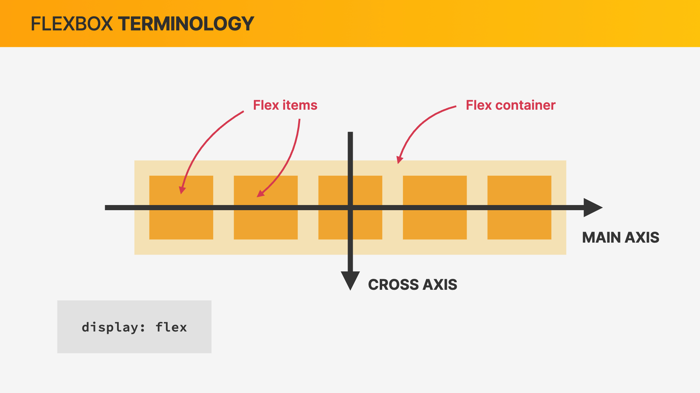
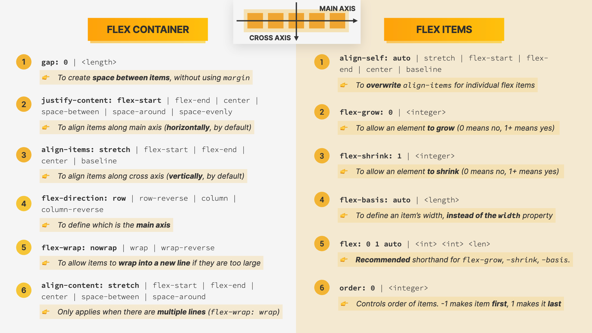

# flex 弹性布局

## flex box

## flex property

## flex 复合属性

`flex` 是 `flex-grow`、`flex-shrink` 和 `flex-basis` 的简写，默认值为 `0 1 auto`

- `flex-grow`: 放大比例，默认为 0，即如果空间不足，也不放大
- `flex-shrink`: 缩小比例，默认为 1，即如果空间不足，会缩小
- `flex-basis`: 初始大小，默认为 auto

### flex: 1

`flex:1` 是 `flex: 1 1 0%` 的简写

- `flex-grow`: 1 元素可以扩展
- `flex-shrink`: 1 元素可以缩小
- `flex-basis`: 0% 元素的初始大小为 0%，即没有固定大小，会根据其他元素动态调整。

当空间**不足**时 `flex: 1` 的元素会尽可能的**缩小**自己的大小；当空间**充足**时，`flex: 1` 会均等的扩展以填充额外的空间。

### flex: auto

`flex:auto` 是 `flex: 1 1 auto` 的简写

- `flex-grow`: 1 元素可以扩展
- `flex-shrink`: 1 元素可以缩小
- `flex-basis`: auto 元素的初始大小根据内容自动调整

当空间**不足**时 `flex: auto` 会保证其内容的最大显示尺寸，可能会导致其他元素的空间被挤压。

当空间**充足**时会扩展，但初始值的大小是基于内容，可能会比 `flex: 1` 的元素更多或更少，取决于内容的初始大小。
