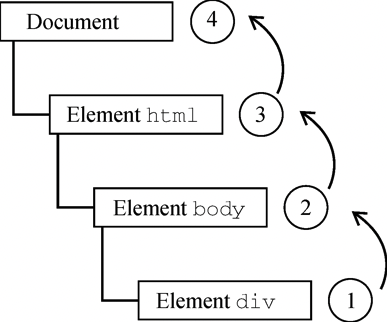
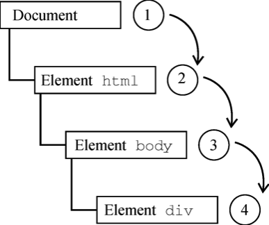
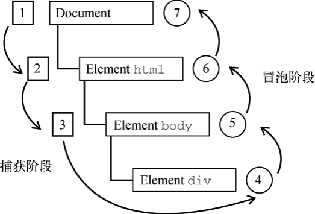

# 事件
JavaScript 与 HTML 的交互就是通过 **事件** 实现的，事件代表文档或浏览器窗口中某个有意义的时刻。可以使用仅在事件发生时执行的**监听器**订阅事件，这种模型叫做“观察者模式”。

## 事件流
### 事件冒泡
事件会从**最深层的节点**开始向上逐级传播，直到达到**文档的根节点**。
```html
<html>
  <head>
    <title>Event Bubbling Example</title>
  </head>
  <body>
    <div id="myDiv">Click Me</div>
  </body>
</html>
```
在上面的例子中，当用户点击 `#myDiv` 元素时，事件会从最深层的节点（`#myDiv`）开始向上传播，直到到达文档的根节点（`<html>`）。



### 事件捕获
事件会从文档的**根节点开始**，然后**向下传播到目标元素**。



### 事件流
DOM2 Events 规范中规定事件流分为三个阶段：事件捕获、到达目标和事件冒泡。事件捕获做线发生，然后到达实际目标接收事件，最后是事件冒泡阶段。



## 事件处理程序
事件意味着用户或浏览器执行的某种动作，比如单击、加载、鼠标悬停。为响应事件而调用的函数叫做**事件处理程序**。
### DOM0 事件处理程序
### DOM2 事件处理程序
DOM2 Events 为事件处理程序添加了两个新方法：`addEventListener()` 和 `removeEventListener()`。暴露在所有的 DOM 节点上。

`addEventListener()` 和 `removeEventListener()` 方法接受三个参数：
- 事件类型（如 `"click"`）
- 事件处理函数
- 是否在捕获阶段调用事件处理函数，默认为 `false`

```javascript
let btn = document.getElementById("myBtn");
let handler = function() {
  alert("Hello World!");
}
btn.addEventListener("click", handler, false);
btn.removeEventListener("click", handler, false);
```
调用 `addEventListener()` 和 `removeEventListener()` 传入同一个函数。

## 事件对象
在 DOM 中发生事件时，所有相关信息都会收集并存在一个 **event** 的对象中。事件对象包含与特定事件相关的属性和方法，常用的**公共属性和方法**有：
- `type`：事件的类型；
- `target`：事件的目标；
- `timeStamp`： 事件发生的时间戳；
- `eventPhase`：事件流阶段；
- `preventDefault()`：阻止事件的默认行为；
- `stopPropagation()`：阻止事件冒泡；
- `stopImmediatePropagation()`：阻止事件冒泡，并阻止其他事件处理程序被调用。

## 事件类型
事件对象会保存什么信息是由事件类型决定的，DOM3 Events 规范中定义了以下事件类型：
- 用户界面事件（UIEvent）：涉及与DOM交互的通用浏览器事件
- 焦点事件（FocusEvent）：涉及**焦点**的浏览器事件
- 鼠标事件（MouseEvent）：涉及**鼠标**的浏览器事件
- 滚轮事件（WheelEvent）：涉及**滚轮**的浏览器事件
- 输入事件（InputEvent）：涉及**输入元素**的浏览器事件
- 键盘事件（KeyboardEvent）：涉及**键盘**的浏览器事件

### 用户界面事件
用户界面事件主要包含以下几种：
- `load`：页面或图像加载完成时触发；
- `unload`：页面或图像卸载完成时触发；
- `resize`：窗口大小改变时触发；
- `scroll`：页面或元素滚动时触发；
- `abort`：页面或图像加载中断时触发；
- `error`：页面或图像加载错误时触发；
- `select`：用户选中文本时触发；

### 焦点事件
焦点事件在页面元素获得或失去焦点时触发。主要使用以下两种：
- `focus`：元素获得焦点时触发；
- `blur`：元素失去焦点时触发；

### 鼠标事件
鼠标事件在用户与页面元素进行鼠标操作时触发。主要使用以下事件：
- `click`：鼠标单击时触发；
- `dblclick`：鼠标双击时触发；
- `mousedown`：鼠标按下时触发；
- `mouseup`：鼠标弹起时触发；
- `mouseover`：鼠标进入元素时触发；
- `mouseout`：鼠标离开元素时触发；
- `mousemove`：鼠标在元素上移动时触发；
- `mouseenter`：鼠标进入元素时触发；
- `mouseleave`：鼠标离开元素时触发；

除了 `mouseenter` 和 `mouseleave` 所有鼠标事件都会冒泡。

## 事件委托
事件委托利用事件冒泡，可以只使用一个事件处理程序来管理一种类型的事件。事件委托是为了减少事件处理程序数量，提高性能。


