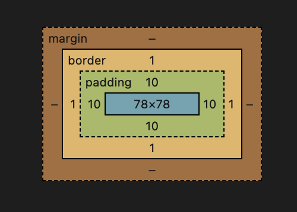
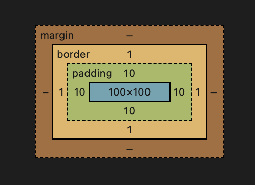

# box-sizing 盒模型

`box-sizing` 有两种常用属性：`content-box` 和 `border-box`

通过代码来比较一下这两种 `box-sizing` 的区别

```html
<div class="box1"></div>
<div class="box2"></div>
```

```css
.box1 {
  box-sizing: border-box;
  width: 100px;
  height: 100px;
  padding: 10px;
  border: 1px solid #ccc;
  background: red
}

.box2 {
  box-sizing: content-box;
  width: 100px;
  height: 100px;
  padding: 10px;
  border: 1px solid #ccc;
  background: blue
}
```

运行代码可以看出，蓝色的盒子 *box2* 明显大于红色的盒子 *box1*。


## border-sizing

上边代码中红色盒子在控制台中计算样式的结果如下：



当 box-sizing 属性设置为 border-box 时，盒子占用的面积 = 设置的 width 和 height = content + padding + border

## content-sizing

上边代码中蓝色盒子在控制台计算样式的结果如下：



当 box-sizing 属性设置为 content-box 时，盒子占用的面积 = 设置的 width 和 height + padding + border
