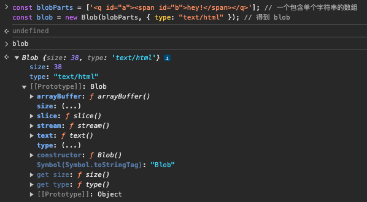

# File 和 Blob
File对象表示一个文件对象，它包含一个字节的只读数据。是一种特殊类型的`Blob`，继承了`Blob`属性和方法。

Blob对象表示一个不可变、原始数据的类文件对象。可作为文本或二进制数据读取，也可以转换为`ReadableStream`用于数据操作。

## File构造函数
```javascript
/**
 * @desc 创建File对象
 * @param {Array<Blob | BufferSource | string>} fileParts 一个可迭代的对象
 * @param {string} fileName 文件名
 * @param {object} options 配置项
 * @param {string} options.type 媒体类型，默认值：""
 * @param {number} options.endings 指定文本编码方式，默认值：`transparent
 * @returns {File} 一个包含指定数据的File对象
 */
new File(fileParts, fileName, options)

// 示例
const file = new File(['foo'], 'foo.txt', { type: 'text/plain' })
```
运行示例：


## Blob构造函数
```javascript
/**
 * @desc 创建Blob对象
 * @param {Array<Blob | BufferSource | string>} blobParts 一个可迭代的对象
 * @param {object} options 配置项
 * @param {string} options.type 媒体类型，默认值：""
 * @param {number} options.endings 指定文本编码方式，默认值：`transparent
 * @returns {Blob} 一个包含指定数据的Blob对象
 */
new Blob(blobParts, options)

// 示例
const blobParts = ['<q id="a"><span id="b">hey!</span></q>']; // 一个包含单个字符串的数组
const blob = new Blob(blobParts, { type: "text/html" }); // 得到 blob
```
运行示例：


从图中可以看到有两个实例属性和四个实例方法：
- `Blob.size`(只读)：，表示Blob对象的大小，单位为字节。
- `Blob.type`：表示该`Blob`对象所包含的MIME类型。
- `Blob.slice()`：返回一个新的Blob对象，其内容由Blob对象从start到end指定的字节序列。
- `Blob.stream()`：返回一个`ReadableStream`对象，该对象包含Blob对象中的字节序列。
- `Blob.arrayBuffer()`：返回一个Promise对象，该Promise对象在Blob对象中的字节序列被读取后，会兑现一个包含该字节序列的ArrayBuffer对象。`
- `Blob.text()`

## Blob使用场景
1.文件下载：通过`window.URL.createObjectURL()`方法，将Blob对象转换为URL，然后通过`<a>`标签下载。
```javascript
/**
 * @desc 文件下载
 * @param {string} url 下载地址
 * @param {string} fileName 下载文件名
 * @returns {void}
 */
async function downloadFile(url, fileName) {
  try {
    // 获取资源
    const response = await fetch(url)
    if (!response.ok) {
      throw new Error(`无法下载文件，状态码：${response.status}`)
    }

    // 将响应体转换为Blob
    const blob = await response.blob()
    // 处理Blob对象，触发下载
    handleDownloadBlob(blob, fileName)
  } catch (error) {
    console.error('文件下载出错:', error)
  }
}

/**
 * @desc 处理Blob对象，触发下载
 * @param {Blob} blob Blob对象
 * @param {string} fileName 下载文件名
 * @returns {void}
 */
function handleDownloadBlob(blob, fileName) {
  // 创建一个临时的URL表示Blob对象
  const url = URL.createObjectURL(blob)

  // 创建隐藏的下载链接
  const a = document.createElement('a')
  a.href = url
  a.download = fileName // 设置下载的文件名
  a.style.display = 'none' // 隐藏链接

  // 将链接添加到DOM中
  document.body.appendChild(a)

  // 触发点击事件开始下载
  a.click()

  // 下载后释放URL并移除隐藏的链接
  URL.revokeObjectURL(url)
  document.body.removeChild(a)
}
```
2.预览图片：通过`window.URL.createObjectURL()`方法，将Blob对象转换为URL，然后通过``标签预览。
```html
<input type="file" id="imageFile" accept="image/*">


<script>
document
  .getElementById('imageFile')
  .addEventListener('change', function (event) {
    const file = event.target.files[0]
    if (!file) return

    // 创建一个Blob URL来预览图片
    const blobURL = URL.createObjectURL(file) // file本身就是一个Blob
    document.getElementById('previewImage').src = blobURL

    // 不需要时释放URL以避免内存泄漏
    document
      .getElementById('previewImage')
      .addEventListener('load', function () {
        URL.revokeObjectURL(blobURL)
      })
  })
</script>
```
<!-- todo：待补充 -->
3.文件切片：通过`Blob.slice()`方法，将Blob对象切割成多个片段，然后上传到服务器。
<!-- todo：待补充 -->
4.本地读取文件：通过`FileReader`对象，将Blob对象转换为文本或二进制数据。