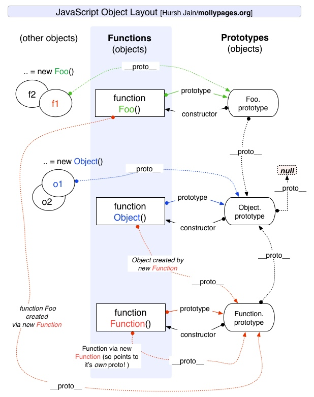

# 原型与原型链
使用`new`关键字创建一个新实例时，会执行哪些操作？
1. 创建新对象：`new`操作符会在内存中创建一个空的JavaScript对象。
2. 设置原型链：新对象内部的`__proto__`属性被设置为构造函数的`prototype`属性的值。
3. 绑定this值：`new`操作符会改变构造函数内部的`this`值，指向新创建的对象。
4. 执行构造函数：`new`操作符调用构造函数，执行构造函数内部的代码，初始化新对象的属性和方法。
5. 返回新对象：如果构造函数没有显示的返回一个对象，`new`操作符回返回第一步创建的新对象。如果显示的返回一个对象，`new`操作符会返回这个对象。

## 原型
在JavaScript中，每个构造函数内部都有一个`prototype`属性，这个属性值是一个对象，称为`原型对象`，包含该构造函数的所有实例共享的属性和方法。  

当使用构造函数新建了一个对象后，这个对象内部包含了一个指针，这个指针指向该构造函数`prototype`属性对应的值（`原型对象`），该指针被称为对象的原型`__proto__`。
```javascript
function Person(name, age) {
  this.name = name;
}

Person.prototype.say = function() {
  console.log(`Hello, my name is ${this.name}`)
}

let person = new Person('Dahu')
person.say()
```
浏览器执行上述代码后，person对象内部包含一个指针，指向Person.prototype对象，也就是`__proto__`属性。


**不推荐**使用`__proto__`，虽然浏览器还支持，但是已从web标准中移除。优先使用`Object.getPrototypeOf()`或者`Reflect.getPrototypeOf()`，返回指定对象的原型。

## 原型链
当尝试访问一个对象的属性或方法时，如果该对象自身没有这个属性或方法，会沿着对象的原型链向上查找，直到原型链的末端。如果整个原型链都没有返回`undefined`。

下图是一条原型链：
 

原型链的终点是`null`：由于`Object`是构造函数，原型链上所有对象都是由`Object`构成的，而`Object.prototype.__proto__`指向`null`，所以原型链终点是`null`。
