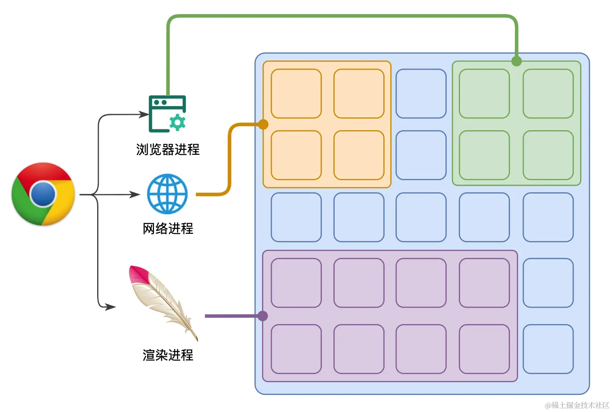
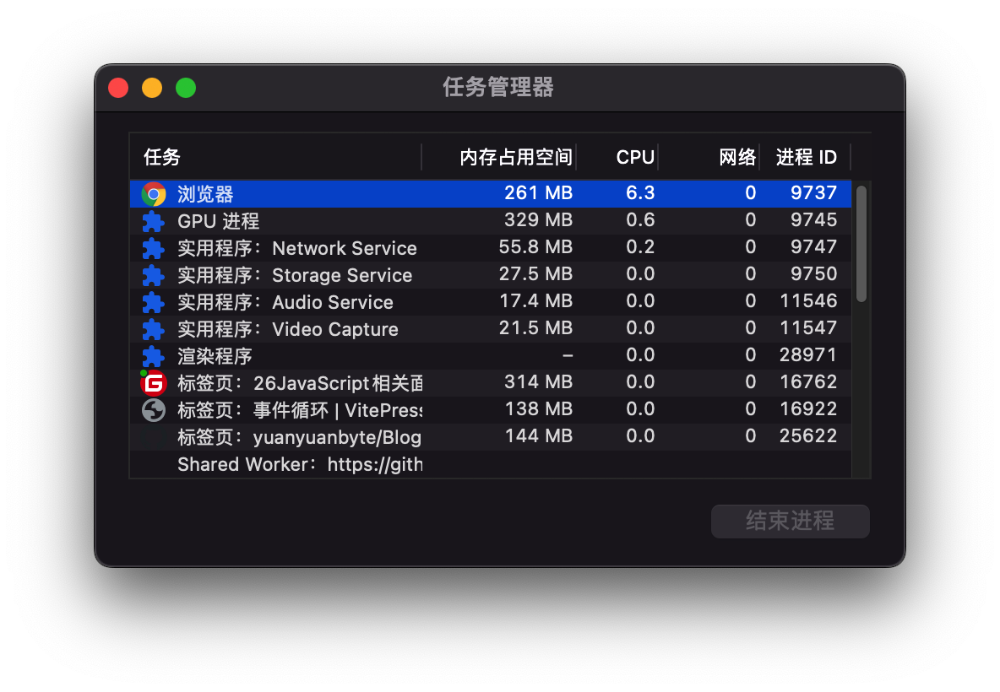
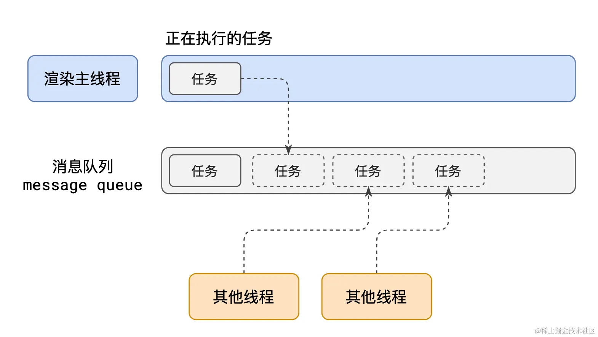
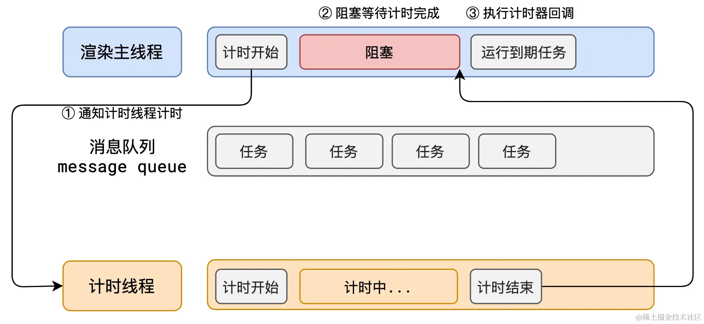

# 事件循环
## 浏览器的进程模型
浏览器是一个**多进程多线程**的应用程序，浏览器内部工作极其复杂。为了避免相互影响，为了减少连环崩溃的几率，当启动浏览器后，它会自动启动多个进程。

其中，最主要的进程有：
1. 浏览器进程：主要负责界面显示、用户交互、子进程管理等。浏览器进程内部会启动多个线程处理不同的任务。
2. 网络进程：负责加载网络资源。网络进程内部会启动多个线程来处理不同的网络任务。
3. **渲染进程**：渲染进程启动后，会开启一个渲染主线程，主线程负责执行 HTML、CSS、JS 代码。
  
默认情况下，浏览器会为每个标签页开启一个新的渲染进程，以保证不同的标签页之间互不影响。


## 渲染主线程是如何工作的
渲染主线程是浏览器中最繁忙的线程，需要它处理的任务包括但不限于：
- 解析 HTML
- 解析 CSS
- 计算样式
- 布局
- 处理图层
- 每秒把页面画 60 次
- 执行全局 JS 代码
- 执行事件处理函数
- 执行计时器的回调函数
- ...

渲染主线成要处理如此多的任务，任务调度成了最大的问题。而渲染主线程是通过**排队**的方式解决任务调度的问题。

1. 在最开始的时候，渲染主线程会进入一个无限循环
2. 每一次循环会检查消息队列中是否有任务存在。如果有，就取出第一个任务执行，执行完一个后进入下一次循环；如果没有，则进入休眠状态。
3. 其他所有线程（包括其他进程的线程）可以随时向消息队列添加任务。新任务会加到消息队列的末尾。在添加新任务时，如果主线程是休眠状态，则会将其唤醒以继续循环拿取任务

整个过程称为**事件循环**（消息循环）

## 理解异步函数
代码在执行过程中，会遇到一些无法立即处理的任务，比如：

- 计时完成后需要执行的任务 —— `setTimeout`、`setInterval`
- 网络通信完成后需要执行的任务 -- `XHR`、`Fetch`
- 用户操作后需要执行的任务 -- `addEventListener`

如果让渲染主线程等待这些任务的时机达到，就会导致主线程长期处于「阻塞」的状态，从而导致浏览器「卡死」。


渲染主线程承担着极其重要的工作，无论如何都不能阻塞！因此，浏览器选择**异步**来解决这个问题。


> 面试题：如何理解 JS 的异步？
> 
> 参考答案：
> 
> JS是一门**单线程**的语言，这是因为它运行在浏览器的渲染主线程中，而渲**染主线程只有一个**。渲染主线程承担着诸多的工作，渲染页面、执行 JS 都在其中运行。
> 
> 如果使用同步的方式，就极有可能导致主线程产生**阻塞**，从而导致**消息队列**中的很多其他任务无法得到执行。这样一来，一方面会导致繁忙的主线程白白的消耗时间，另一方面导致页面无法及时更新，给用户造成卡死现象。
> 
> 所以浏览器采用**异步**的方式来避免。具体做法是当某些任务发生时，比如计时器、网络、事件监听，主线程将任务**交给其他线程去处理**，自身立即结束任务的执行，转而执行后续代码。当其他线程完成时，将事先传递的回调函数包装成任务，**加入到消息队列的末尾排队，等待主线程调度执行**。
> 
> 在这种异步模式下，浏览器永不阻塞，从而最大限度的保证了单线程的流畅运行

## 消息队列的优先级
执行下面代码会发生什么：
```html
<h1>Mr.Yuan is awesome!</h1>
<button>change</button>
<script>
  var h1 = document.querySelector('h1');
  var btn = document.querySelector('button');
​
  // 死循环指定的时间
  function delay(duration) {
    var start = Date.now();
    while (Date.now() - start < duration) {}
  }
​
  btn.onclick = function () {
    h1.textContent = '袁老师很帅！';
    delay(3000);
  };
</script>
```
点击按钮后，三秒钟内之后才 h1 内容变更为【袁老师很帅！】。

为啥不是立即变更呢？因为h1.textContent的内容确实变更了，但是渲染到页面需要绘制，绘制任务也会被放到队列中，但是在绘制之前还有个delay(3000)，然后才是绘制。

---

在渲染进程中，任务是没有优先级的，但**消息队列是有优先级的**，根据[W3C](https://html.spec.whatwg.org/multipage/webappapis.html#perform-a-microtask-checkpoint)最新解释：
- 每个任务都有一个任务类型，同一个类型的任务必须在一个队列，不同类型的任务可以分属于不同的队列。 在一次事件循环中，浏览器可以根据实际情况从不同的队列中取出任务执行。
- 浏览器必须准备好一个微队列，微队列中的任务优先所有其他任务执行。

目前chrome的实现中至少包含以下队列：
- 延时队列：用于存放计时器到达后的回调任务，优先级「中」
- 交互队列：用于存放用户操作后产生的事件处理任务，优先级「高」
- 微队列：用户存放需要最快执行的任务，优先级「最高」


> 面试题：阐述一下 JS 的事件循环
> 
> 事件循环又叫做消息循环，是浏览器渲染主线程的工作方式。
> 
> 在 Chrome 的源码中，它开启一个不会结束的 for 循环，每次循环从消息队列中取出第一个任务执行，而其他线程只需要在合适的时候将任务加入到队列末尾即可。
> 
> 过去把消息队列简单分为宏队列和微队列，这种说法目前已无法满足复杂的浏览器环境，取而代之的是一种更加灵活多变的处理方式。
> 
> 根据 W3C 官方的解释，每个任务有不同的类型，同类型的任务必须在同一个队列，不同的任务可以属于不同的队列。不同任务队列有不同的优先级，在一次事件循环中，由浏览器自行决定取哪一个队列的任务。但浏览器必须有一个微队列，微队列的任务一定具有最高的优先级，必须优先调度执行。

