# 页面渲染

当浏览器的网络线程收到 HTML 文档后，会产生一个渲染任务，并将其传递给渲染主线程的消息队列。在事件循环机制的作用下，渲染主线程取出消息队列中的渲染任务，开启渲染流程。

整个渲染流程分为：HTML 解析、样式计算、布局、分层、绘制、分块、光栅化、画。

## 1. 解析 HTML
解析 HTML 生成 DOM 树 和 CSSOM 树。

CSSOM（CSS Object Model）树是浏览器在解析 CSS 样式表并应用到HTML文档上时创建的一种数据结构。它代表了CSS规则集，这些规则集最终决定了文档中元素的外观。

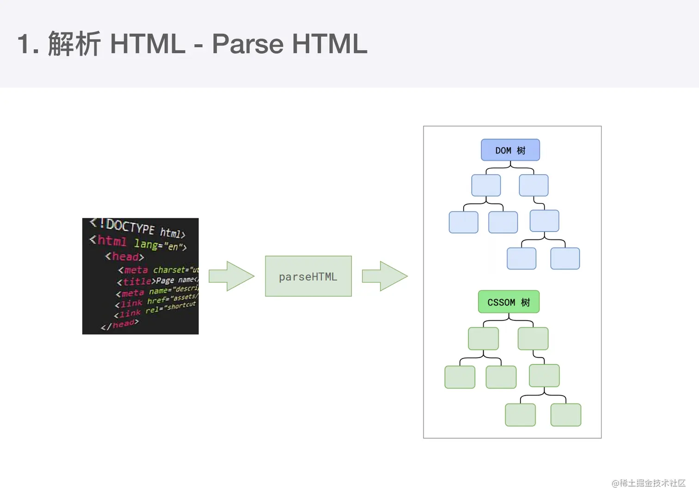

解析过程中遇到 CSS 解析 CSS，遇到JS 执行 JS。为了提高效率，浏览器开始解析前会启动一个**预解析**的线程，率先下载 HTML 中的外部 CSS 文件 和 JS 文件。

如果主线程解析到 `<link>` 位置，外部 CSS 文件还没有下载解析好，主线程不会等待，继续解析后续的HTML。因为下载和解析 CSS 的工作是在预解析线程中进行的。也就是 CSS 不会阻塞 HTML解析的根本原因。

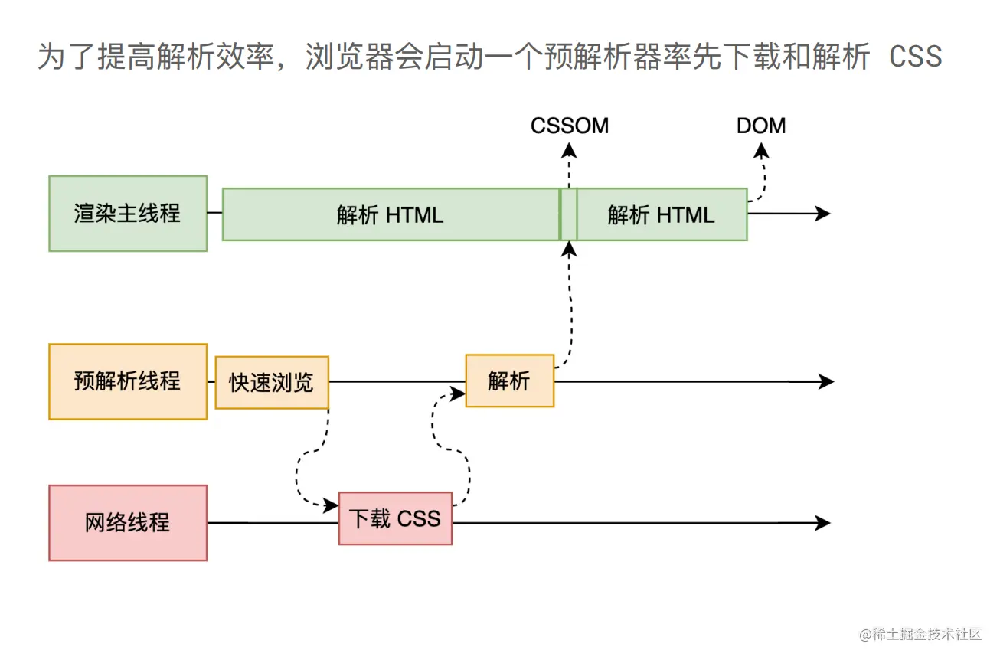

如果主线程解析到 `<script>` 位置，会停止解析 HTML，转而等待 JS 文件下载好，并将全局代码解析执行完成后，才能继续解析 HTML。这是因为 JS 代码的执行过程可能会修改当前的 DOM 树，所以 DOM 树的生成必须暂停。这就是 JS 会阻塞 HTML 解析的根本原因。

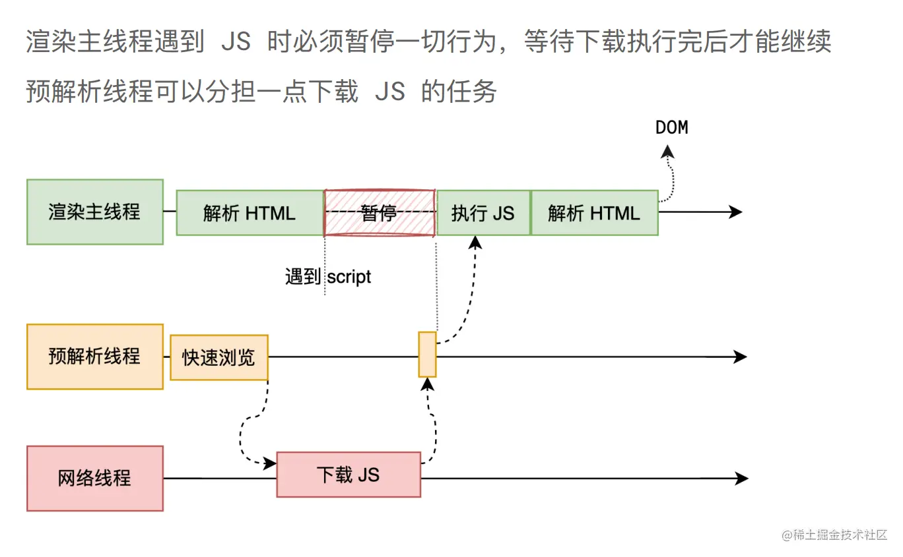

## 2. 样式计算
主线程遍历 DOM 树，计算每个元素的样式。

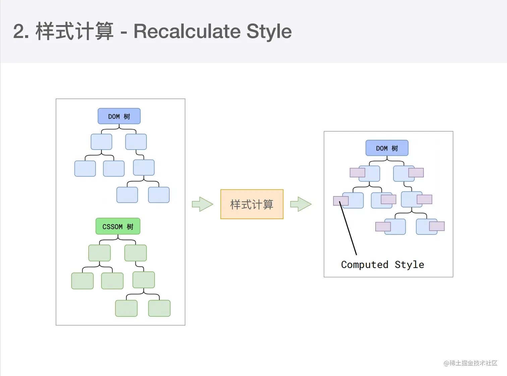

## 3.布局
遍历新生成 带有样式的 DOM 树，计算每个节点的几何信息，例如宽高、相对包含块的位置，生成布局树。

布局树 与 DOM 树节点关系并非一一对应的。比如 `display:none` 的节点没有几何信息，因此不会生成到布局树。
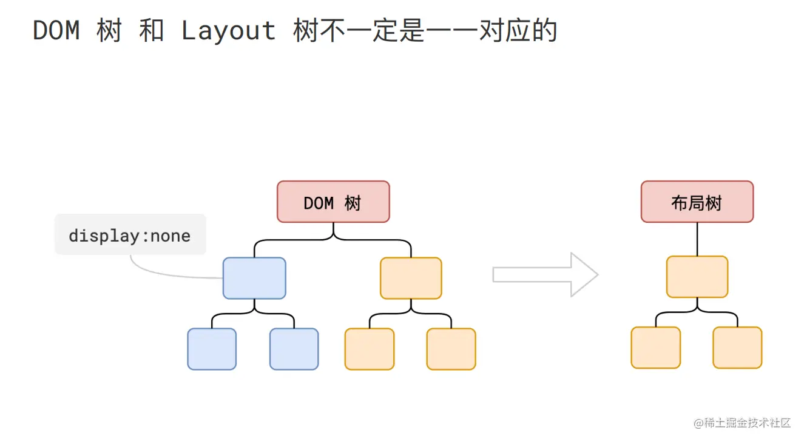

比如使用了伪元素选择器`::before`、`::after`，虽然 DOM 树中不存在这些伪元素节点，但它们拥有几何信息，所以会生成到布局树中
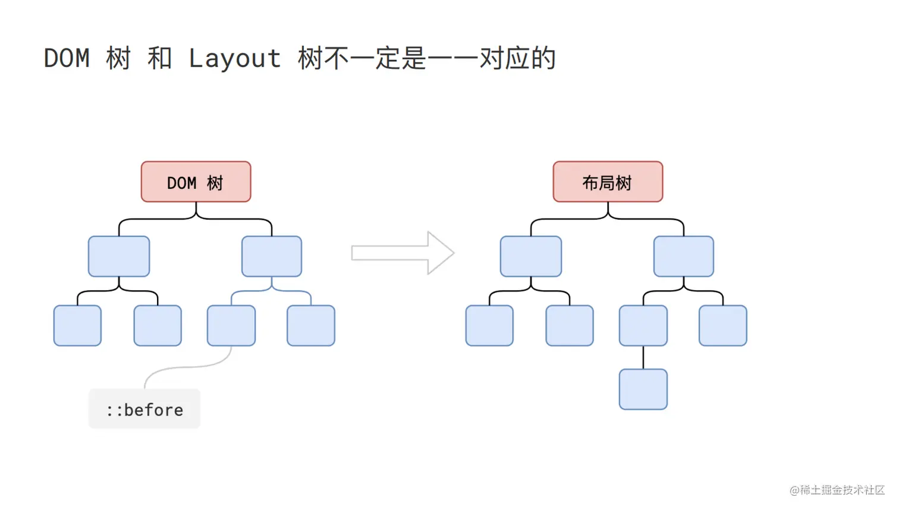

再比如匿名行盒、匿名块盒等等都会导致 DOM 树和布局树无法一一对应
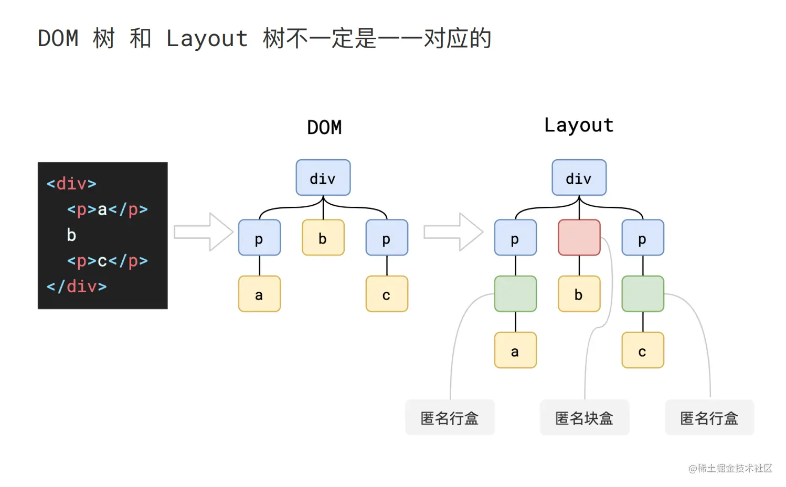

## 4.分层
为了确定哪些元素需要放置在哪一层，主线程需要遍历整颗布局树来创建一棵层次树。

分层的好处在于，将来某一个层改变后，仅会对该层进行后续处理，从而提升效率。

滚动条、堆叠上下文、transform、opacity 等样式都会或多或少的影响分层结果，也可以通过使用 will-change 属性来告诉浏览器对其分层。

## 5.绘制
主线程会为每个层单独产生绘制指令集，用于描述这一层的内容该如何画出来。

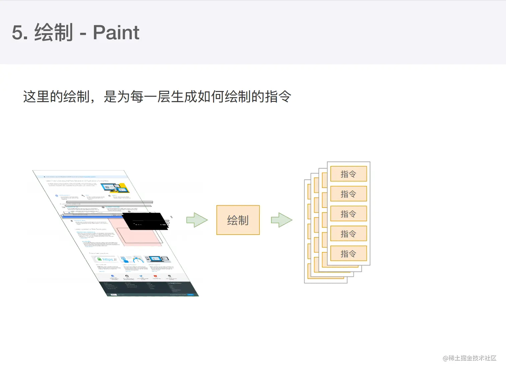

## 6.分块
完成绘制后，主线程将每个图层的绘制信息提交给合成线程，剩余工作将由合成线程完成。

合成线程首先对每个图层进行分块，将其划分为更多的小区域。

它会从线程池中拿取多个线程来完成分块工作。
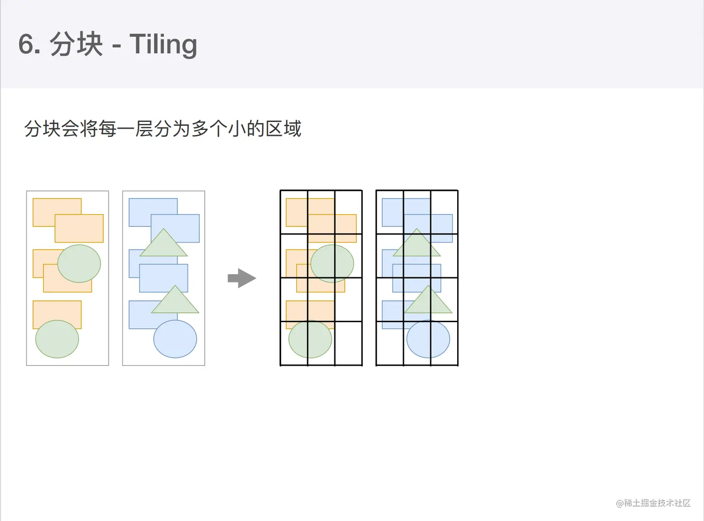

## 7.光栅化
光栅化是将每个块变成位图，位图可以理解成内存里的一个二维数组，这个二维数组记录了每个像素点信息。

合成线程会将块信息交给 GPU 进程，以极高的速度完成光栅化。

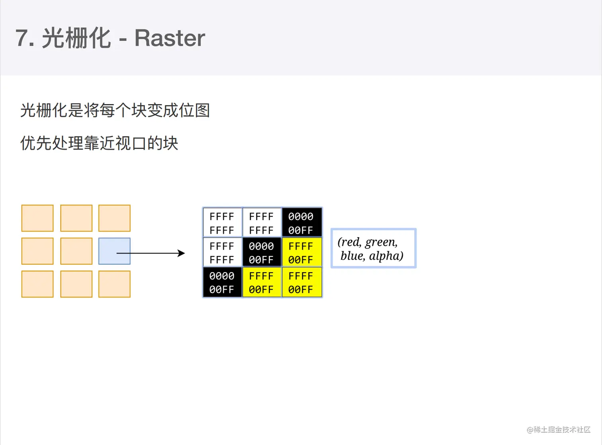

## 8.画
合成线程拿到每个层、每个块的位图后，生成一个个「指引（quad）」信息。
指引会标识出每个位图应该画到屏幕的哪个位置，以及会考虑到旋转、缩放等变形。
变形发生在合成线程，与渲染主线程无关，这就是transform效率高的本质原因。
合成线程会把 quad 提交给 GPU 进程，由 GPU 进程产生系统调用，提交给 GPU 硬件，完成最终的屏幕成像。

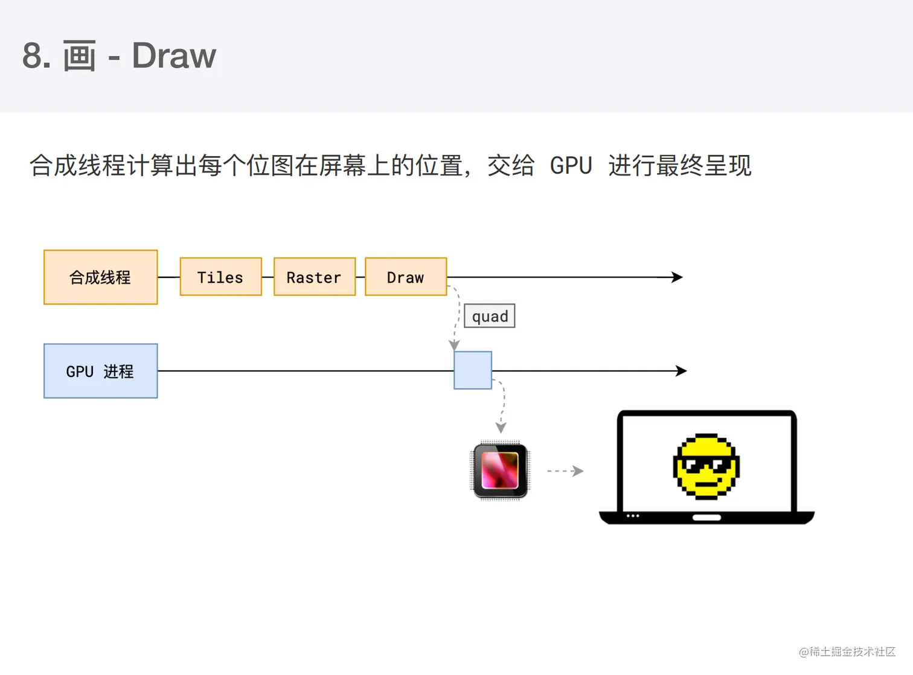

## 重排 reflow
CSS重排（reflow），也被称为回流，是指浏览器为了**更新布局而重新计算元素的几何属性**的过程。

当DOM树中的元素尺寸、位置或者相关属性发生改变时，浏览器需要重新计算元素的位置和大小，并且可能会重新绘制整个页面或者部分区域。重排可能由以下几种情况触发：
- 元素尺寸的变化：例如，修改元素的宽度、高度、边距、填充等。
- 内容的更改：比如，文本内容的增加或减少，这可能会影响行高或容器的尺寸。
- DOM结构的变动：如元素的添加、删除或移动。
- 样式属性的修改：例如，通过JavaScript修改style属性或类名。
- 窗口大小的调整：当浏览器窗口大小改变时，可能需要重新计算布局。

避免重排的方式：
- 批量操作：尽量将可能引起重排的操作分组在一起执行，减少重排的次数。例如，使用requestAnimationFrame来确保所有样式和布局的更新都在下一帧之前完成。
- 使用translate代替定位：使用CSS的transform: translate()可以避免重排，因为它是基于已有的布局进行位移，不会触发新的布局计算。
- 使用position: absolute或position: fixed：这些定位方式可以避免某些元素参与正常的文档流，从而减少它们对其他元素的影响。
- 避免强制同步布局：避免在JavaScript中频繁读取布局相关的属性，如offsetWidth、offsetHeight等，因为这可能会触发重排。

为了避免连续的多次操作导致布局树反复计算，浏览器会合并这些操作，当 JS 代码全部完成后再进行统一计算。所以，改动属性造成的 reflow 是异步完成的。也同样因为如此，当 JS 获取布局属性时，就可能造成无法获取到最新的布局信息。浏览器在反复权衡下，最终决定**获取属性**立即 reflow

控制重排是前端性能优化的一个重要方向。

## 重绘 repainting
当浏览器需要**更新屏幕上的视觉表现**时，它会执行重绘操作，即使布局没有变化。换句话说，**重绘是在不改变元素位置的情况下更新元素的外观。** 

触发重绘的条件：
- 样式变化：例如颜色、背景、边框样式或可见性（visibility）等非布局属性的改变。
- 图像加载：当图片加载完毕，浏览器需要将其显示到屏幕上时，会触发重绘。
- CSS动画或过渡效果：当应用动画或过渡效果时，每一帧的更新都需要重绘。
- 光标或选择状态的改变：例如，文本被选中或鼠标悬停在元素上时，可能需要重绘以反映状态变化。

避免重绘的方式：
- 使用合成层：通过将元素放置在独立的合成层中，可以减少重绘对其他元素的影响。通常使用translateZ(0), will-change, 或者transform: scale(1)等CSS属性可以创建一个合成层。
- 优化CSS动画和过渡：使用硬件加速的属性，如transform和opacity，而不是软件渲染的属性，如color或background-color。
- 避免昂贵的样式计算：减少在JavaScript中对样式属性的读写操作，尤其是那些可能触发重绘的属性。

## 重绘与重排的区别：
- 重排涉及元素尺寸和位置的改变，通常是因为布局计算的结果发生变化，这会影响到周围元素的位置和尺寸。
- 重绘则是在元素的尺寸和位置不变的情况下，更新其视觉外观，如颜色、背景、边框等。