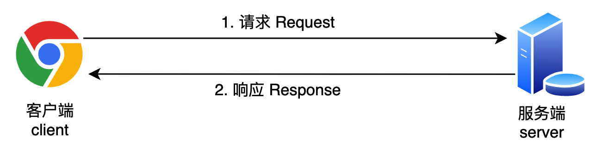
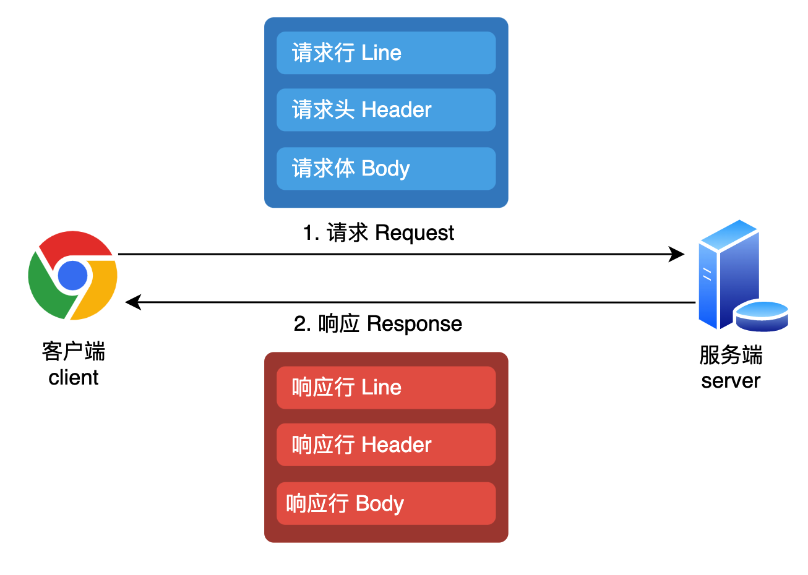
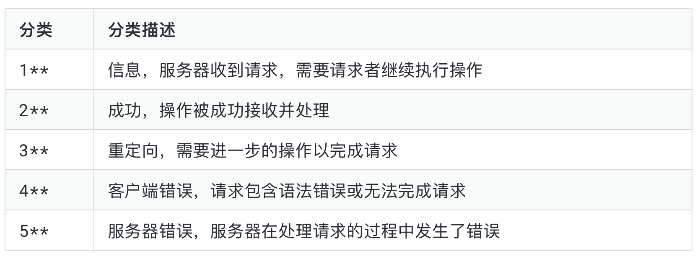

# HTTP 协议

超文本协议（Hypertext Transfer Protocol）是互联网上应用最广泛的协议，它定义了客户端和服务器之间交换数据的格式。

该协议规定了两方面的内容：

- 传递消息的模式
- 传递消息的格式

## HTTP 传递消息的模式

HTTP 传递消息的模式是客户端-服务器模式，客户端向服务器发送请求，服务器返回响应。


## HTTP 传递消息的格式



## 请求消息

HTTP 传递请求消息的格式是文本格式，分为三个部分：

```text
请求行：请求方法、统一资源标识符URI、HTTP协议版本
请求头

请求体
```

```http
<!-- GET 请求 -->
GET /home.html HTTP/1.1
Host: developer.mozilla.org
User-Agent: Mozilla/5.0 (Macintosh; Intel Mac OS X 10.9; rv:50.0) Gecko/20100101 Firefox/50.0
Accept: text/html,application/xhtml+xml,application/xml;q=0.9,*/*;q=0.8
Accept-Language: en-US,en;q=0.5
Accept-Encoding: gzip, deflate, br
Referer: https://developer.mozilla.org/testpage.html
Connection: keep-alive
Upgrade-Insecure-Requests: 1
If-Modified-Since: Mon, 18 Jul 2016 02:36:04 GMT
If-None-Match: "c561c68d0ba92bbeb8b0fff2a9199f722e3a621a"
Cache-Control: max-age=0

<!-- POST 请求 -->
POST /api/user/login HTTP/1.1
Host: study.duyiedu.com
Content-Type: application/json

{
  "loginId":"admin",
  "loginPwd":"123123"
}
```

### 请求方法

HTTP 请求方法定义了客户端向服务器发起请求是的动作类型，HTTP/1.1 定义了 9 种请求方法：

- GET: 表示向服务器获取资源。业务数据在请求行中，无须请求体
- POST: 表示向服务器提交信息，通常用于产生新的数据，比如注册。业务数据在请求体中
- PUT: 表示希望修改服务器的数据，通常用于修改。业务数据在请求体中
- DELETE: 表示希望删除服务器的数据。业务数据在请求行中，无须请求体。
- OPTIONS: 发生在跨域的预检请求中，表示客户端向服务器申请跨域提交
- TRACE: 回显服务器收到的请求，主要用于测试和诊断
- CONNECT: 用于建立连接管道，通常在代理场景中使用，网页中很少用到

### [请求头](https://developer.mozilla.org/zh-CN/docs/Web/HTTP/Headers)

- `Accept` 通知服务器可以发回的数据类型。
- `Accept-Encoding` 通知服务器可以接受哪些编码。
- `Accept-Language` 通知服务器可以接受哪些语言。
- `Connection` 控制当前请求完成后网络连接是否保持打开状态。
- `Content-Type` 表示标头用于指示资源的原始**媒体类型**

  `Content-Type: application/x-www-form-urlencoded` 通常用于提交表单数据，数据以键值对的形式编码，键和值之间用 `=` 分隔，每对之间用 `&` 分隔。

  ```http
     POST /login HTTP/1.1
     Host: example.com
     Content-Type: application/x-www-form-urlencoded

     username=admin&password=secret
  ```

  `Content-Type: multipart/form-data` 通常用于文件上传，因为它可以处理二进制数据，请求体包含了一个边界字符串，分割不同部分。

  ```http
  POST /upload HTTP/1.1
  Host: example.com
  Content-Type: multipart/form-data; boundary=----WebKitFormBoundary7MA4YWxkTrZu0gW

  ----WebKitFormBoundary7MA4YWxkTrZu0gW
  Content-Disposition: form-data; name="file"; filename="example.txt"
  Content-Type: text/plain

  文件内容
  ----WebKitFormBoundary7MA4YWxkTrZu0gW
  Content-Disposition: form-data; name="description"

  这是一个示例文件
  ----WebKitFormBoundary7MA4YWxkTrZu0gW--
  ```

  `Content-Type: application/json` 以 JSON 作为数据格式时使用

  ```http
  POST /users HTTP/1.1
  Host: example.com
  Content-Type: application/json

  {
     "name": "John Doe",
     "email": "john.doe@example.com"
  }
  ```

  `Content-Type: text/plain` 纯文本数据，可能用于简单的文本输入或输出。

  ```http
  POST /logs HTTP/1.1
  Host: example.com
  Content-Type: text/plain

  This is a log message.
  ```

  `Content-Type: application/octet-stream` 用于传输二进制数据，如文件或图像，但不包含任何关于数据结构的信息。

  ```http
  POST /binary HTTP/1.1
  Host: example.com
  Content-Type: application/octet-stream

  [二进制数据]
  ```

  `Content-Type: application/xml` XML 数据格式在某些 API 中仍然很常见，尽管 JSON 的使用更为广泛。

  ```http
  POST /orders HTTP/1.1
  Host: example.com
  Content-Type: application/xml

  <order>
     <item>Widget</item>
     <quantity>10</quantity>
  </order>
  ```

- `User-Agent` 标注了客户端的浏览器类型、版本、操作系统等信息。
- `Host` 标注了 `URL` 地址中的 `Domain + Port`，比如`Host: study.duyiedu.com:80`。

## 响应消息

HTTP 传递响应消息的格式是文本格式，分为三个部分：

```text
状态行：HTTP协议版本、状态码、状态描述
响应头

响应体
```

```http
HTTP/1.1 200 OK
Date: Tue, 14 Nov 2000 12:45:26 GMT
Server: Apache/1.3.6 (Unix) (Red-Hat/Linux)
Last-Modified: Wed, 08 Aug 2001 11:21:54 GMT
ETag: "3f80f-1b6-3e1cb03b"
Content-Type: text/html; charset=UTF-8
Content-Length: 1234

<!DOCTYPE html>
<html>
<head>
    <title>Example Page</title>
</head>
<body>
    <h1>Welcome to Example.com</h1>
    <p>This is an example page.</p>
</body>
</html>
```

### 状态码



1. 200 OK：一切正常。

2. 301 Moved Permanently：资源已被永久重定向。

   `你的请求我收到了，但是呢，你要的东西不在这个地址了，我已经永远的把它移动到了一个新的地址，麻烦你取请求新的地址，地址我放到了响应头的Location中了`

   > 试试请求：www.douyutv.com

3. 302 Found：资源已被临时重定向。

   `你的请求我收到了，但是呢，你要的东西不在这个地址了，我临时的把它移动到了一个新的地址，麻烦你取请求新的地址，地址我放到了请求头的Location中了`

4. 304 Not Modified：文档内容未被修改。

   `你的请求我收到了，你要的东西跟之前是一样的，没有任何的变化，所以我就不给你结果了，你自己就用以前的吧。啥？你没有缓存以前的内容，关我啥事`

5. 400 Bad Request：语义有误，当前请求无法被服务器理解。

`你给我发的是个啥啊，我听都听不懂`

6. 403 Forbidden：服务器拒绝执行。

   `你的请求我已收到，但是我就是不给你东西`

7. 404 Not Found：资源不存在。

   `你的请求我收到了，但我没有你要的东西`

8. 500 Internal Server Error：服务器内部错误。

   `你的请求我已收到，但这道题我不会，解不出来，先睡了`

### (响应头)[https://developer.mozilla.org/zh-CN/docs/Web/HTTP/Headers]

- `Cache-Control`
