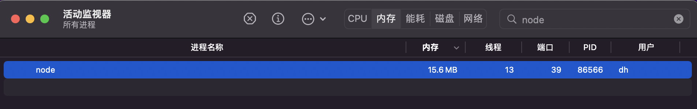
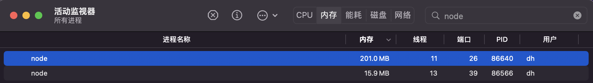
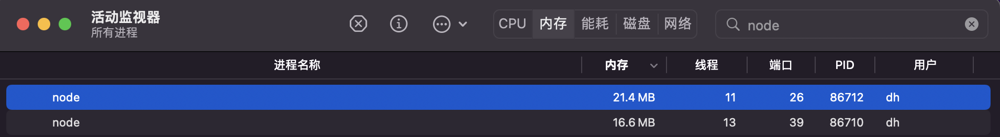

# Stream 类
在Node.js中，`Stream`是一种用于**处理读写数据**的方式，可以高效的处理大量数据。`Stream`的核心优势在于**逐步处理数据**，不需要一次性将数据全部加载到内存中，而是分块处理。从而极大提高处理大数据时的性能和效率，**降低了内存占用**。

## Stream VS fs.readFile 读取文件时内存占用
1. 创建bigText.txt文件，约200M
```javascript
const fs = require('fs')
const writeStream = fs.createWriteStream('../assets/bigText.txt')
for (let i = 0; i < 10000000; i++) {
  writeStream.write(`这是第${i}行\n`)
}
writeStream.end()
console.log('写入完成')
```
2. 使用`fs.readFile()`方法读取文件
```javascript
const fs = require('fs')
const http = require('http')
const server = http.createServer()

server.on('request', (request, response) => {
  fs.readFile('../assets/bigText.txt', (error, data) => {
    if (error) throw error
    response.end(data)
  })
})

server.listen(8889)
```
启动服务后，查看内存占用


打开浏览器，发送请求，查看内存占用，可以看到内存占用变为200M，和文件大小差不多。


3. 使用`stream.pipe()`方法读取文件 
```javascript
const fs = require('fs')
const http = require('http')
const server = http.createServer()

server.on('request', (request, response) => {
  const stream = fs.createReadStream('../assets/bigText.txt')
  stream.pipe(response)
})
server.listen(8889)
```
启动服务后，打开浏览器，查看内存占用


通过上面几张图的对比，可以发现在内存占用、性能方面，`stream.pipe()`方法比`fs.readFile()`方法要高效。

## Stream 原型
所有的`Stream`对象都继承自`EventEmitter`类，因此可以使用`EventEmitter`提供的方法来监听事件。包括`data`、`end`、`error`、`close`等。原型链结构：
- `EventEmitter`所有`Stream`类型的底层基础，提供了实践机制。
  - `Stream`
    - `Readable Stream`可读流，例如`fs.createReadStream()`。
    - `Writable Stream`可写流，例如`fs.createWriteStream()`。
    - `Duplex Stream`双向流
    - `Transform Stream`转化流

## Readable Stream 可读流
`Readable Stream`用于从数据源读取数据，数据源可以是文件、网络请求或其他可读流。分为

#### 流动模式 与 暂停模式：
- 流动模式：在这种模式下，数据会从底层系统读取，通过`EventEmitter`接口的事件提供给应用程序。一旦监听`data`事件、调用`pipe()`方法会自动切换到流模式
- 暂停模式：在这种模式下，数据不会从底层系统读取，必须显示调用`stream.read()`方法来获取数据。在可读流创建时默认处于暂停模式。

#### 事件：
- `data`：当流中**有数据可读**时触发。
- `end`：当**没有数据可读**时触发。
- `error`：在接受和发送数据时发生错误时触发。
- `close`：当流关闭时触发。
- `readable`：暂停模式下，当流中有数据可读时触发。

#### 方法：
- `stream.pause()`：暂停流动模式中的数据流动。
- `stream.resume()`：恢复流动模式中的数据流动。
- `stream.pipe(destination[, option])`将当前可读流的数据自动导向（pipe）到一个可写流`destination`中。这是处理数据流之间传输的便捷方法，自动管理背压（backpressure）。
- `stream.read([size])`：在暂停模式下，从流中读取数据。size参数指定读取的大小，可选。

#### 示例
```javascript
const fs = require('fs');
const readStream = fs.createReadStream('./test.txt');

readStream.on('data', (chunk) => {
  console.log('读取到数据：', chunk.toString())
})

readStream.on('end', () => {
  console.log('读取数据完成！')
})

readStream.on('error', (err) => {
  console.log('读取数据出错：', err)
})
```

## Writable Stream 可写流
`Writable Stream`用于向数据源写入数据，数据源可以是文件、网络请求或其他可写流。

#### 事件：
- `finish`：所有数据写入完成，没有错误时会触发。
- `error`：在写入数据时发生错误时触发。
- `drain`：当流之前因为缓冲区满而暂停写入（调用了write()返回false），在缓冲区有足够空间接受更多数据时触发。

#### 方法：
- `stream.write(chunk[, encoding][, callback])`：向流中写入数据，如果当前缓冲区满，该方法可能返回false，此时应停止写入直到drain事件触发。chunk参数可以是Buffer或字符串，encoding参数指定编码，callback参数是一个回调函数，当数据写入完成时调用。
- `cork()` 和 `uncork()`：这两个方法用来控制是否允许数据立即写出。调用cork()后，写入的数据会被暂时缓存而不立即发出，直到调用uncork()，这时所有缓存的数据会被一次性写出。
- `final(callback)`：添加一个回调，该回调在流完成所有操作（包括刷新内部缓冲区）后调用，无论是否发生错误。

#### 示例
```javascript
const fs = require('fs')
const path = require('path')

const readStream = fs.createReadStream(
  path.join(__dirname, '../assets/text.txt')
)
const writeStream = fs.createWriteStream(
  path.join(__dirname, '../assets/text-backup.txt')
)
let count = 1

readStream.pipe(writeStream)
readStream.on('data', (chunk) => {
  console.log(`第${count++}读文件`)
  console.log(chunk.toString())
})

readStream.on('end', () => {
  console.log('文件读取完毕')
})
```

## 缓存区与背压
**缓冲区**：是临时存储数据的内存区域，适用于处理二进制数据。在流处理中，缓冲区作为数据的中转站，帮助协调不同速度的读写操作，特别是在读写不同步的情况下。

**背压**：在可写流写入数据`stream.write()`时，如果流的**写入速度慢于读取速度**，数据会被暂存在缓冲区中。当可写流的**内部缓冲区**接近满载时，`write()`方法会返回false。

**控制方法**：可写流允许通过`highWaterMark`选项设置缓冲区的大小，从而控制流的行为。较大的缓冲区可以减少写操作的阻塞，但会增加内存使用；较小的缓冲区则能更快响应背压，但可能导致频繁的写操作暂停。

#### 示例
```javascript
const fs = require('fs')
const path = require('path')

// readStream默认的highWaterStream默认是64 * 1024
const readStream = fs.createReadStream(
  path.join(__dirname, '../assets/text.txt')
)
// 设置缓冲区大小为16 * 1024
const writeStream = fs.createWriteStream(
  path.join(__dirname, '../assets/text-backup.txt'),
  { highWaterMark: 16 * 1024 }
)
// 增加最大监听器数量
writeStream.setMaxListeners(20)

readStream.on('data', (chunk) => {
  writeStream.write(chunk)
  // 如果写入被暂停，等待drain
  if (!writeStream.write('')) {
    writeStream.once('drain', () => {
      console.log('Buffer drained, can write more data now.')
    })
  }
})

```