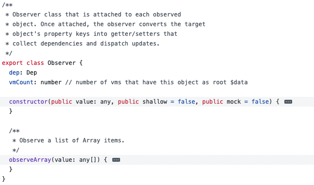
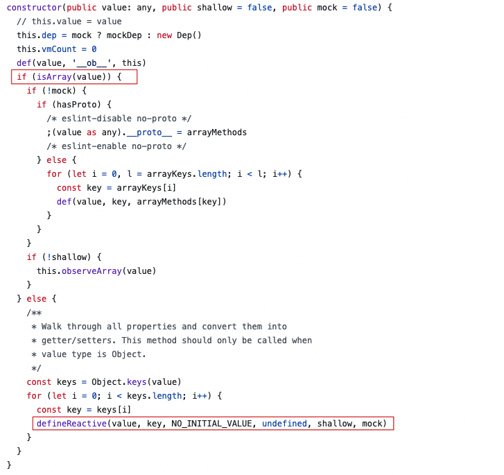
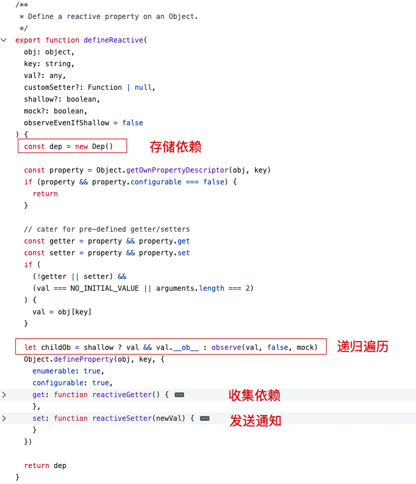
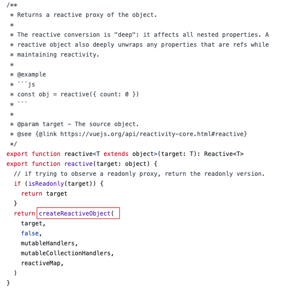
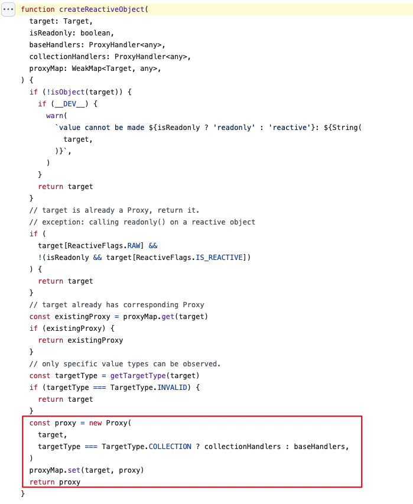

# 响应式原理

1. 什么是响应式
2. 为什么需要响应式
3. 带来了什么好处
4. vue 响应式如何实现，有哪些优缺点
5. vue3 响应式有什么变化

所谓数据响应式就是能够时数据变化可以被检测并且对这种变化做出响应的机制。

MVVM 框架中要解决的一个核心问题就是连接数据层和视图层，通过**数据驱动**应用，数据变化，视图更新。

在 vue 中，通过数据响应式加上虚拟DOM和patch算法，开发人员只需要操作数据，关心业务，完全不用接触繁琐的DOM操作，从而大量提升开发效率。

## vue2 数据响应式

vue2 中的数据响应式会根据不同数据类型做出不同处理：

- **对象**：采用 `Object.defineProperty()` 的方式进行数据劫持，当数据被访问或者修改时，通知观察者。
- **数组**：通过覆盖数据对象原型的7个变更方法，使这些方法可以额外的做更新通知，从而实现数据响应。

### 注意事项

由于 `Object.defineProperty()` API 语法的原因，vue2 响应式数据中存在一些问题点需要注意

#### 对于对象

无法检测对象 property 的添加和删除，由于 Vue 会在初始化实例时对 property 执行 getter / setter 转化，所以 property 必须在 `data` 对象上存在才能让 Vue 将它转换为响应式的。

```js
var vm = new Vue({
  data:{
    a:1
  }
})

// `vm.a` 是响应式的

vm.b = 2
// `vm.b` 是非响应式的
```

对于已经创建的实例，Vue 不允许添加根级别的响应式 property。但是可以通过使用 `Vue.set(object, propertyName, value)` 方式向嵌套对象添加响应式 property。

```js
Vue.set(vm.somgObject, 'b', 2)
```

也可以使用 `vm.$set` 实例方法

```js
this.$set(vm.someObject, 'b', 2)
```

#### 对于数组

Vue 不能检测以下变动的数组：

- 利用索引直接设置一个数组项时，例如：`vm.items[indexOfItem] = newValue`
- 修改数组的长度时，例如：`vm.items.length = newLength`

通过一下两种方式可以实现和 `vm.items[indexOfItem] = newValue` 相同的效果，同时也将在响应系统内触发状态更新

```js
// Vue.set
Vue.set(vm.items, indexOfItem, newValue)

vm.$set(vm.items, indexOfItem, newValue)
```

```js
// Array.prototype.splice
vm.items.splice(indexOfItem, 1, newValue)
```

为了解决第二类问题可以使用 `splice`

```js
vm.items.splice(newLength)
```

### 实现原理

vue2 通过 [Observer](https://github.com/vuejs/vue/blob/main/src/core/observer/index.ts) 类实现数据响应式，通过遍历对象的属性，将属性转换为 getter/setter。



在 Observer Class 源码注释中写道：Observer Class 会附加到每个被观察对象的上。一旦附加，观察者将目标对象的属性键转换为getter/setter，用于收集依赖项和分派更新。



在 constructor 实例化方法中，判断是对象还是数组，如果是数组调用原型方法 `observeArray`，如果是对象则调用 `defineReactive` 方法。



`defineReactive` 会在对象上定义一个响应属性。在 getter 方法中收集依赖，存储在 Dep Class 中，在 setter 方法中触发依赖。

## Vue3 数据响应式

为了解决这些问题，Vue3 利用 ES6 的 Proxy API，通过 Proxy 实现对数据的代理，当数据发生变化时，会触发 Proxy 的 set 方法，从而通知观察者。

vue3 的编程体验是一致的，不需要使用特殊的 API，初始化性能和内存消耗得到的大幅改善。由于响应画的实现代码抽取了独立的 reactivity 包，可以灵活的使用。

### [reactive](https://github.com/vuejs/core/blob/main/packages/reactivity/src/reactive.ts) 实现原理



reactive 函数接收一个对象，调用 `createReactiveObject` 方法，返回一个响应式数据。响应式转换是“深度”的:它影响所有嵌套的属性。



在 `createReactiveObject` 方法中创建代理对象，如果是 `Map`、`Set`、`WeakMap`、`WeakSet` 则代理 `colleactionHanlders`，数组类型则代理 `baseHandlers`。

### [ref](https://github.com/vuejs/core/blob/main/packages/reactivity/src/ref.ts) 实现原理

... todo
<!-- ## 观察者模式

观察者模式包含两个角色——观察者（Observer）和被观察者（Subject）。被观察者会维护一个观察者列表，当状态发生改变时会通知观察者。观察者调用更新方法。

## 发布订阅模式

发布订阅模式中包含发布者、订阅者和事件中心三个角色。发布者和订阅者之间是解耦的，发布者负责将**消息发布**至事件中心。订阅者负责从事件中心接收**订阅消息**， 它们之间没有直接的依赖关系。

发布订阅模式在 vue 中应用场景：

1. **事件总线 Event Bus**：Vue 实例可以作为事件总线使用，用于非父子组件之间的通信。

```js
const eventBus = new Vue()

// 发布事件
eventBus.$emit('eventName', data)

// 订阅事件
eventBus.$on('eventName', data => {
  console.log(data)
})
```

2. $emit 和 $on
3. Vuex：状态管理库，通过 mutations 和 actions 分发状态变更，getters负责订阅状态

## Vue 响应式各组件之间关系

Vue 功能

- 负责接受初始化的参数（options）
- 负责把 data 中的属性注入到 Vue 实例，转换为 getter/setter
- 负责调用 observer 监听 data 中所有属性的变化
- 负责调用 complier 解析指令/差值表达式
  
Observer 功能

- 负责把 data 选项中的属性转换成响应式数据。data 中的某个属性也是对象，把该属性转换成响应式数据。
- 数据变化发送通知；

compiler 功能

- 负责编译模板，解析指令、差值表达式
- 负责页面的首次渲染
- 当数据变化后重新渲染页面

dep 功能：负责收集观察者，当数据发生变化时，通知观察者更新。

watcher 功能：

- 当数据变化触发依赖，dep通知所有watcher实例更新视图
- 自身实力化时往dep对象中添加自己 -->
