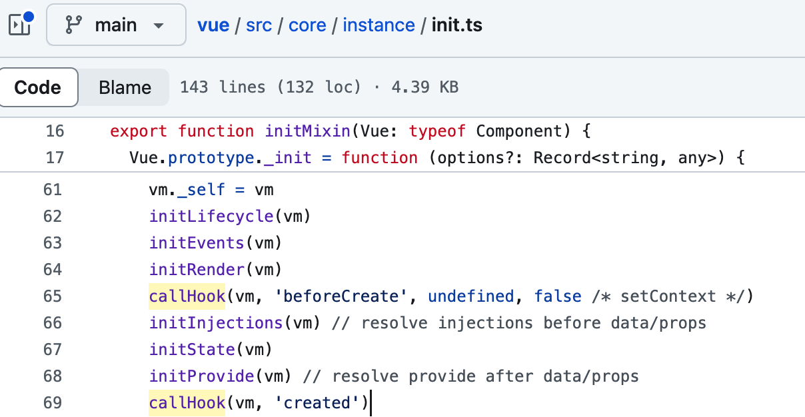

# Vue 生命周期

每个 Vue 组件实例在创建时都需要经历一系列的初始化步骤，比如设置好数据侦听，编译模板，挂载实例到 DOM，以及在数据改变时更新 DOM。

在此过程中也会运行生命周期钩子函数，生命周期钩子函数作用是允许开发者在**特定阶段**执行一些操作。

## Vue 生命周期阶段

Vue 生命周期分为 8 个阶段：创建前后、载入前后、更新前后、销毁前后，以及一些特殊场景的生命周期。

- beforeCreate：在**组件实例初始化完成之后**立即调用。在这个阶段，实例只完成了初始化，还未初始化数据（`data` 和 `props`），也没有编译模板或挂载实例 `$el`。此时还**不能访问到数据和方法**。
- created：当组件实例完成数据观测、属性和方法的运算、`watch/event` 事件回调的配置（与**状态相关的选项**）后调用。在这个阶段，你可以访问到所有的数据和方法，但是 `$el` 还没有被挂载到 DOM 中。
- beforeMount：在模板编译完成并且准备将实例的 `$el` **挂载到 DOM 中之前**调用。此时已经可以访问到 `$el`，但尚未挂载到 DOM 上。
- mounted：在**实例被挂载到 DOM 后**调用。此时可以访问到真实的 DOM 元素，可以进行 DOM 操作。
- beforeUpdate：在组件即将**因为一个响应式状态变更而更新其 DOM 树之前**调用。当响应式属性变化导致虚拟 DOM 更新之前调用。在此期间，你可以访问到新的属性值，但实际的 DOM 还未更新。
- updated：在组件**因为一个响应式状态变更而更新其 DOM 树之后**调用。当响应式属性变化导致虚拟 DOM 更新并完成 DOM 渲染之后调用。此时可以访问到最新的 DOM。
- beforeUnmount（~~beforeDestroy~~）：在一个组件实例被**卸载之前**调用。在实例销毁之前调用。在这个阶段，可以进行一些清理工作，例如取消事件监听器或定时器。
- unmounted（~~destroyed~~）：在一个组件实例被**卸载之后**调用。在实例被完全销毁后调用。此时实例的所有指令都被解除绑定，事件监听器已经被移除，子实例也已被销毁。

vue2 初始化源码截图如下

页面首次加载完成会触发beforeCreate，created，beforeMount，mounted，在mounted之后，真实的DOM挂载完成，数据完成双向绑定，页面加载完毕。

## 多组件中（父子组件）生命周期的调用顺序

组件的调用顺序都是先父后子，渲染完成的顺序是先子后父。组件的销毁操作是先父后子，销毁完成的顺序是先子后父。

- 加载渲染过程：父beforeCreate->父created->父beforeMount->子beforeCreate->子created->子beforeMount- >子mounted->父mounted；
- 子组件更新过程：父beforeUpdate->子beforeUpdate->子updated->父updated；
- 父组件更新过程：父 beforeUpdate -> 父 updated；
- 销毁过程：父beforeDestroy->子beforeDestroy->子destroyed->父destroyed；

## setup 为什么没有 beforeCreate 和 created

在组合式 API 中，`setup` 函数在组件初始化完成之后立即调用，在 `beforeCreate` 和 `created` 阶段之前。

在这个阶段，组件的数据响应式已经设置好，但是模板还未开始编译。

所以说 `setup` 提供了一个更早的执行时机来初始化组件的状态，覆盖了 `beforeCreate` 和 `created` 阶段。
