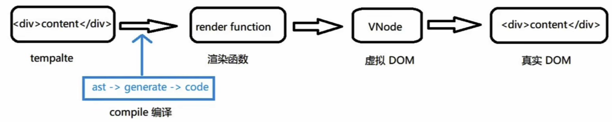
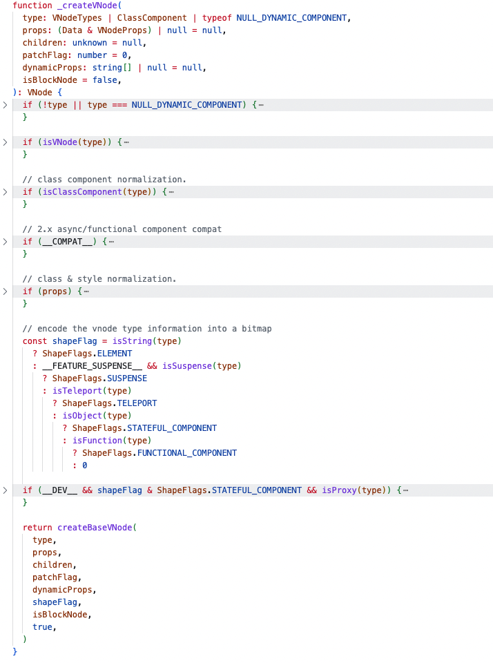
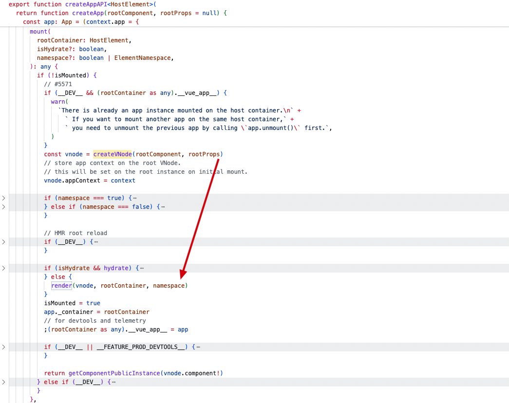
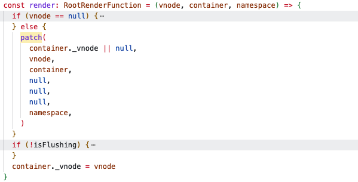
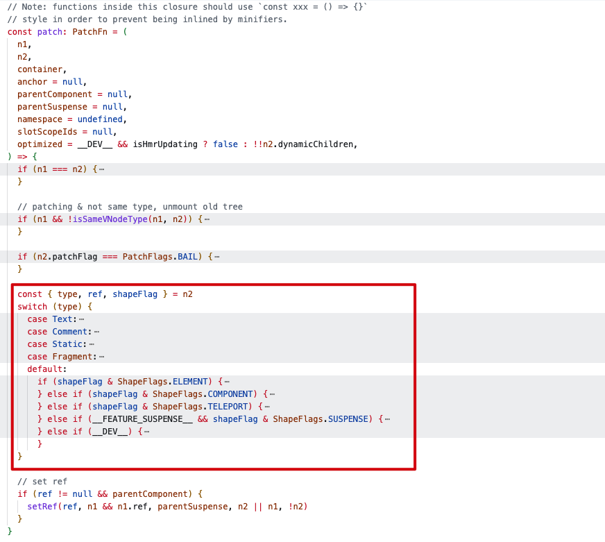

# 虚拟 DOM

1. vdom 是什么
2. 引入 vdom 的好处
3. vdom 如何生成，又如何成为 dom
4. 后续的 diff的作用

虚拟 DOM 是一种对实际 DOM 的抽象表示，是一个 JavaScript 对象，通过不同的属性描述了视图结构。

## 虚拟 DOM 优势

### 将真实元素节点抽象成VNode，有效减少直接操作 dom 次数，从而提高程序性能

直接操作 dom 是有限制的，比如：diff、clone 等操作，一个真是元素上有许多的内容，如果直接对其进行 diff 操作，会去额外 diff 一些没有必要的内容。同样，如果需要进行 clone 那么需要将其全部内容进行复制，这也是没有必要的。

将这些操作转移到 JavaScript 对象中，就会变得简单。

操作 dom 是比较昂贵的操作，频繁的 dom 操作容易引起页面的重绘制和回流，通过抽象 VNode 进行中间处理，可以有效减少直接 dom 操作，从而减少页面绘制和回流。

### 方便实现跨平台

同一 VNode 节点可以渲染成不同平台上队因的内容。比如：渲染在浏览器是 dom 元素节点，渲染在 Native（iOS、Android）变为对应的控件、可以实现 SSR、渲染到 WebGL 中等等。

Vue3 中允许开发者基于 VNode 实现自定义的渲染器，从而实现跨平台。

## 虚拟 DOM 生成

### 渲染过程

在组件初始化是 vue 会调用 compile 方法编译模板，将模板转化为 `render` 函数。在挂在 mount 阶段，会调用 `render` 函数，返回的对象就是虚拟 dom，在后续的 patch 过程中进一步转化为 dom。

挂载过程结束后，vue程序进入更新流程。如果某些响应式数据发生变化，将会引起组件重新render，此时会生成新的vdom，和上一次的渲染结果diff就能得到变化的地方，从而转化为最小量的dom操作，高效更新视图。

### [VNode](https://github.com/vuejs/core/blob/main/packages/runtime-core/src/vnode.ts) 接口定义

### 创建 vnode

`_createVNode` 函数是创建虚拟 DOM 节点的核心方法，处理了多种类型的组件和属性，确保VNode正确构建。主要做了一下事情：

### 首次调用

首次挂载时调用 `createVNode` 函数，传入跟组件，创建虚拟 DOM 节点，调用 `render` 函数。

`render` 函数中如果传入 `vnode` 进入 `patch` 调用，`patch` 将虚拟 DOM 转化为真实 DOM。

`patch` 方法会根据不同 `type` 类型进行相应处理，在初始化渲染根节点时进入`processComponent` 方法。最终会调用 `setupRenderEffect` 方法，将 `render` 函数返回的 `vnode` 渲染成真实 DOM。`
