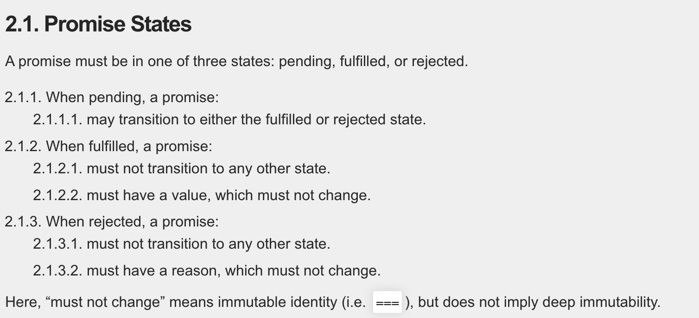

# myPromise

实现`myPromise`时参照`Promise`的使用和`Promise/A+`规范。

## 初始化 MyPromise Class

当通过`new`关键字调用`Promise`构造函数时，接收一个函数`executor`作为参数。`executor`接收两个**函数参数**`resolve`和`reject`。

```javascript
const promise = new Promise((resolve, reject) => {
  console.log("promise");
}); // promise
```

创建`myPromise`类，接收一个`executor`函数作为参数，声明实例方法`resolve`和`reject`。当`executor`函数执行时`this`会指向`myPromise`实例，从而访问实例方法。

```javascript
class MyPromise {
  constructor(executor) {
    executor(this.resolve, this.reject);
  }
  resolve = () => {};
  reject = () => {};
}
```

## Promise State

Promises/A+规范截图


`promise`有三种状态：`pending`、`fulfilled`、`rejected`

- 初始状态为`pending`；
- 执行`resolve`函数后状态变为`fulfilled`；
- 执行`reject`函数后状态变为`rejected`。

状态一旦发生改变后，就不会再改变。

```javascript
const promise = new Promise((resolve, reject) => {
  resolve("success");
  reject("fail");
});
console.log(promise); // Promise {<fulfilled>: 'success'}
```

在`myPromise`中定义三种状态，默认状态为`pending`，执行`resolve`方法时将状态置为`fulfilled`，执行`reject`方法时将状态置为`rejected`。

状态只能从`pengind` -> `fulfilled` 或者 `pending` -> `rejected`。

```javascript
class myPromise {
  + static PENDING = 'pending'
  + static FULFILLED = 'fulfilled'
  + static REJECTED = 'rejected'

  constructor(executor) {
    executor(this.resolve, this.reject)
  }

  + promiseState = myPromise.PENDING // 初始化状态

  // pending -> fulfilled
  resolve = () => {
  +  if (this.promiseState !== myPromise.PENDING) return
  +  this.promiseState = myPromise.FULFILLED
  }
  // pending -> rejected
  reject = () => {
    if (this.promiseState !== myPromise.PENDING) return
    this.promiseState = myPromise.REJECTED
  }
}
```

## resolve 和 reject 传参

`resolve`和`reject`方法接收一个参数，执行时传递给`then`方法中的回调函数。

`then`方法接收两个函数参数`onFulfilled` 和 `onRejected`，当 promise 状态为`fulfilled`时，执行`onFulfilled`成功回调，状态为 rejected 时，执行`onRejected`失败回调。

```javascript
const promise = new Promise((resolve, reject) => {
  resolve("success");
});
promise.then((value) => {
  console.log("success");
});
```

在`myPromise`中声明一个变量`PromiseResult`用来存储`resolve`和`reject`方法传递的参数。

```javascript
class myPromise {
  static PENDING = "pending";
  static FULFILLED = "fulfilled";
  static REJECTED = "rejected";

  constructor(executor) {
    executor(this.resolve, this.reject);
  }

  promiseState = myPromise.PENDING;
  promiseResult = null; // 存储执行结果

  resolve = (value) => {
    if (this.promiseState !== myPromise.PENDING) return;
    this.promiseState = myPromise.FULFILLED;
    this.promiseResult = value; // 赋值成功结果
  };
  reject = (reason) => {
    if (this.promiseState !== myPromise.PENDING) return;
    this.promiseState = myPromise.REJECTED;
    this.promiseResult = reason; // 赋值失败原因
  };

  then(onFulfilled, onRejected) {
    // 成功时执行onFulfilled，失败时执行onRejected
    if (this.promiseState === "fulfilled") {
      onFulfilled(this.promiseResult);
    } else if (this.promiseState === "rejected") {
      onRejected(this.promiseResult);
    }
  }
}
```

## 执行异步函数

目前实现的`myPromise`只考虑了同步代码，接下来处理在`executor`函数体中是写入异步代码。

首先考虑这段代码的执行顺序？

```javascript
const promise = new Promise((resolve, reject) => {
  // 同步执行，promise立即改变。
  // resolve('success')

  // 异步函数，promise.then() 等待状态改变，1s后执行。
  setTimeout(() => {
    resolve("success");
  }, 1000);
});

promise.then((value) => {
  console.log(value); // success
});
```

上述代码执行顺序：

1. 执行`new Promise`，遇到`setTimeout`定时器，加入宏任务队列等待；
2. 执行`promise.then`方法，此时`promise`实例状态为`pending`，等待状态改变；
3. 执行`setTimeout`定时器，改变`promise`实例状态为`fulfilled`；
4. 执行`promise.then`成功回调函数。

在执行异步函数时，`promise`实例的状态不会立即改变，`promise.then`方法执行时要处理这种情况。

在执行`promise.then`方法时将`onFulfilled` 和 `onRejected`存储起来，在`promise`实例改变时执行。

```javascript
class myPromise {
  static PENDING = 'pending'
  static FULFILLED = 'fulfilled'
  static REJECTED = 'rejected'

  constructor(executor) {
    executor(this.resolve, this.reject)
  }

  promiseState = myPromise.PENDING
  promiseResult = null
  + onFulfilledCallback = null // 存储成功回调
  + onRejectedCallback = null // 存储失败回调

  resolve = (value) => {
    if (this.promiseState !== myPromise.PENDING) return
    this.promiseState = myPromise.FULFILLED
    this.promiseResult = value
  + this.onFulfilledCallback && this.onFulfilledCallback(this.promiseResult) // 状态改变时，如果有成功回调执行
  }
  reject = (reason) => {
    if (this.promiseState !== myPromise.PENDING) return
    this.promiseState = myPromise.REJECTED
    this.promiseResult = reason
  + this.onRejectedCallback && this.onRejectedCallback(this.promiseResult) // 状态改变时，如果有失败回调执行
  }

  then(onFulfilled, onRejected) {
    if (this.promiseState === 'fulfilled') {
      onFulfilled(this.promiseResult)
    } else if (this.promiseState === 'rejected') {
      onRejected(this.promiseResult)
    + } else {
      // pending状态时存储成功和失败回调函数
    + this.onFulfilledCallback = onFulfilled
    +  this.onRejectedCallback = onRejected
    }
  }
}
```

## 处理 promise.then()多次调用

`promise.then`方法支持多次调用，注意**不是**链式调用。

```javascript
const promise = new Promise((resolve, reject) => {
  setTimeout(() => {
    resolve("success");
  });
});

promise.then(() => {});
promise.then(() => {});
promise.then((val) => {
  console.log(val); // success
});
```

为了实现多次调用，要将每个`promise.then`方法中的回调函数存储起来，在执行`resolve`和`reject`方法，按照存储顺序将其取出并执行。

为了存储多个`promise.then`方法中的回调函数，要对`onFulfilledCallback`和`onRejectedCallback`进行修改。

```javascript
class myPromise {
  static PENDING = 'pending'
  static FULFILLED = 'fulfilled'
  static REJECTED = 'rejected'

  constructor(executor) {
    executor(this.resolve, this.reject)
  }

  promiseState = myPromise.PENDING
  promiseResult = null
  + onFulfilledCallbacks = [] // 数据结构，存储多个成功回调
  + onRejectedCallbacks = [] // 数组结构，存储多个失败回调

  resolve = (value) => {
    if (this.promiseState !== myPromise.PENDING) return
    this.promiseState = myPromise.FULFILLED
    this.promiseResult = value
    // 依次从onFulfilledCallbacks中取出回调函数并执行
    + while (this.onFulfilledCallbacks.length)
    +  this.onFulfilledCallbacks.shift()(this.promiseResult)
  }
  reject = (reason) => {
    if (this.promiseState !== myPromise.PENDING) return
    this.promiseState = myPromise.REJECTED
    this.promiseResult = reason
    // 依次从onRejectedCallbacks中取出回调函数并执行
    + while (this.onRejectedCallbacks.length)
    +  this.onRejectedCallbacks.shift()(this.promiseResult)
  }

  then(onFulfilled, onRejected) {
    if (this.promiseState === 'fulfilled') {
      onFulfilled(this.promiseResult)
    } else if (this.promiseState === 'rejected') {
      onRejected(this.promiseResult)
    } else {
      // 将成功回调和失败回调存储进onFulfilledCallbacks和onRejectedCallbacks中
      + this.onFulfilledCallbacks.push(onFulfilled)
      + this.onRejectedCallbacks.push(onRejected)
    }
  }
}
```

## promise.then 链式调用

`promise.then()`是可以进行链式调用的，之所以能进行链式调用，是因为其执行完后返回一个新的 promise 对象。

在`promise.then`成功和失败回调函数中返回的值，会传递下一个`promise.then`中。

```javascript
const promise1 = new Promise((resolve, reject) => {
  setTimeout(() => {
    resolve("success");
  });
});
const promise2 = promise1.then((val) => {
  console.log(val);
  return val;
});

promis2.then((val) => {
  console.log(val);
});
```

为了实现链式调用，要在`promise.then`方法执行后返回一个新的 promise 对象。`promise.then`方法中成功和失败回调函数中的**返回值**会传递给下一个 promise。这个返回值可以是一个普通变量，也可以是一个 promise 对象，为了解决`promise2`状态，定义`resolvePromise`方法

```javascript
 * @param  {promise} promise2 promise1.then方法返回的新的promise对象
 * @param  {[type]} x         promise1中onFulfilled或onRejected的返回值
 * @param  {[type]} resolve   promise2的resolve方法
 * @param  {[type]} reject    promise2的reject方法
 */

function resolvePromise(promise, x, resolve, reject) {}
```

```javascript
const MyPromise = require("./source");

class myPromise {
  static PENDING = "pending";
  static FULFILLED = "fulfilled";
  static REJECTED = "rejected";

  constructor(executor) {
    executor(this.resolve, this.reject);
  }

  promiseState = myPromise.PENDING;
  promiseResult = null;
  onFulfilledCallbacks = [];
  onRejectedCallbacks = [];

  resolve = (value) => {
    if (this.promiseState !== myPromise.PENDING) return;
    this.promiseState = myPromise.FULFILLED;
    this.promiseResult = value;
    while (this.onFulfilledCallbacks.length)
      this.onFulfilledCallbacks.shift()();
  };
  reject = (reason) => {
    if (this.promiseState !== myPromise.PENDING) return;
    this.promiseState = myPromise.REJECTED;
    this.promiseResult = reason;
    while (this.onRejectedCallbacks.length) this.onRejectedCallbacks.shift()();
  };

  then(onFulfilled, onRejected) {
    let promise = new MyPromise((resolve, reject) => {
      if (this.promiseState === "fulfilled") {
        setTimeout(() => {
          let x = onFulfilled(this.promiseResult);
          resolvePromise(promise, x, resolve, reject);
        }, 0);
      } else if (this.promiseState === "rejected") {
        setTimeout(() => {
          let x = onRejected(this.promiseResult);
          resolvePromise(promise, x, resolve, reject);
        }, 0);
      } else {
        this.onFulfilledCallbacks.push(() => {
          setTimeout(() => {
            let x = onFulfilled(this.promiseResult);
            resolvePromise(promise, x, resolve, reject);
          }, 0);
        });
        this.onRejectedCallbacks.push(() => {
          setTimeout(() => {
            let x = onFulfilled(this.promiseResult);
            resolvePromise(promise, x, resolve, reject);
          }, 0);
        });
      }
    });
    return promise;
  }
}

function resolvePromise(promise, x, resolve, reject) {
  if (x instanceof myPromise) {
    promise.then(resolve, reject);
  } else {
    resolve(x);
  }
}
```

疑问？为什么 resolve 会出现在实例方法，executor(this.resolve.bind())就不会
