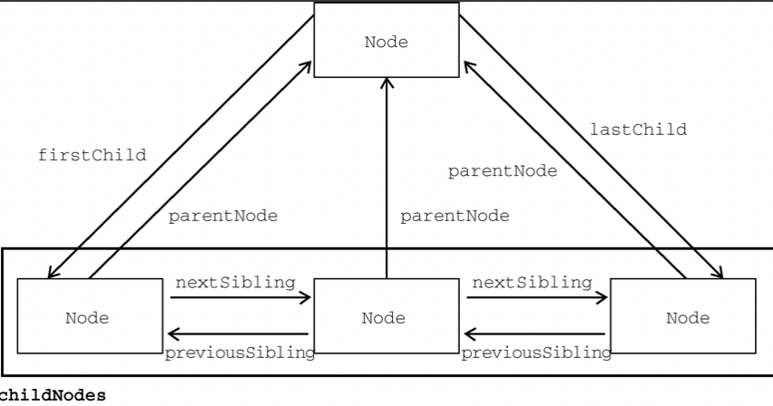

# DOM 文档对象模型

文档对象模型（DOM，Document Object Model）是HTML文档的编程接口。DOM表示由多层节点构成的文档，通过它可以添加、删除和修改页面的各个部分。

任何HTML文档都可以用DOM表示为一个由**节点**构成的层级结构，DOM中总共有12种节点类型。

## Node 类型

在 JavaScript中，所有节点都继承 Node 类型。

属性：

- nodeType：返回节点类型。
  - Node.ELEMENT_NODE = 1; 元素节点
  - Node.TEXT_NODE = 3; 文本节点
  - Node.COMMENT_NODE = 8; 注释节点
  - Node.DOCUMENT_NODE = 9; 文档节点
  - Node.DOCUMENT_TYPE_NODE = 10; 文档类型节点
- nodeName：返回节点的名称。
- nodeValue：返回节点的值。

**节点关系**属性：

- childNodes：返回 NodeList 对象，包含当前节点的所有子节点。
- parentNode：返回当前节点的父节点。
- firstChild：返回当前节点的第一个子节点。
- lastChild：返回当前节点的最后一个子节点。
- previousSibling：返回当前节点的前一个兄弟节点。
- nextSibling：返回当前节点的后一个兄弟节点。



常用实例方法

- `Node.appendChild()` 方法用于将一个节点**添加**到当前节点的子节点列表**末尾**。
- `Node.insertBefore()` 方法用于将一个节点**插入**到当前节点的子节点列表中**指定位置**。
- `Node.removeChild()` 方法用于从当前节点的子节点列表中**移除**一个节点。
- `Node.replaceChild()` 方法用于**替换节点列表中**当前节点的子的**指定节点**。
- `Node.cloneNode()` 方法用于**复制**一个节点，并返回**复制后的节点**。
- `Node.hasChildNodes()` 方法用于判断当前节点**是否有子节点**。

```javascript
/**
 * 添加节点
 * @param {Node} newNode 要添加的节点
 * @returns {Node} 返回添加的节点
 */
let returnNode = someNode.appendChild(newNode);

/**
 * 插入节点
 * @param {Node} newNode 要插入的节点
 * @param {Node} referenceNode 参考节点
 * @returns {Node} 返回插入的节点
 */
let returnNode = someNode.insertBefore(newNode, referenceNode);

/**
 * 移除节点
 * @param {Node} oldNode 要移除的节点
 * @returns {Node} 返回移除的节点
 */
let returnNode = someNode.removeChild(someNode.firstChild);

/**
 * 替换节点
 * @param {Node} newNode 要替换的节点
 * @param {Node} oldNode 要被替换的节点
 * @returns {Node} 返回被替换的节点
 */
let returnNode = someNode.replaceChild(newNode, someNode.firstChild);

/**
 * 复制节点
 * @param {boolean} deep 是否复制子节点
 * @returns {Node} 返回复制的节点
 */
let cloneNode = someNode.cloneNode(true);

/**
 * 判断是否有子节点
 * @returns {boolean} 返回是否有子节点
 */
let hasChildNodes = someNode.hasChildNodes();
```

## Docuemnt 类型

Document 对象表示整个HTML文档，有以下特征：

- nodeType 等于 9；
- nodeName 等于 "#document"；
- nodeValue 等于 null；

常用属性：

- documentElement：返回文档的根元素。
- body：返回文档的 body 元素。
- head：返回文档的 head 元素。
- title：返回文档的 title 元素。
- url：返回文档的完整的URL。
- referrer：返回引用当前文档的文档的URL。
- domain：返回文档的域。
- cookie：返回文档的 cookie。

常用实例方法：

- `Document.getElementById()` 方法用于获取**指定 id 的元素**。
- `Document.getElementsByTagName()` 方法用于获取指定**标签名的元素**。
- `Document.getElementsByClassName()` 方法用于获取指定**类名的元素**。
- `Document.querySelector()` 方法用于获取与**指定 CSS 选择器**匹配的**第一个元素**。
- `Document.querySelectorAll()` 方法用于获取与**指定 CSS 选择器匹配的所有元素**。
- `Document.createTextNode()` 方法用于创建一个**文本**节点。
- `Document.createElement()` 方法用于创建一个**元素**节点。

```js
/**
 * 获取元素
 * @param {string} id 元素的 id
 * @returns {HTMLElement} 返回元素
 */
const element = document.getElementById('#id');

/**
 * 获取元素
 * @param {string} tagName 元素的标签名
 * @returns {HTMLCollection} 返回元素集合
 */
const elements = document.getElementsByTagName('div');

/**
 * 获取元素
 * @param {string} selector CSS 选择器
 * @returns {HTMLCollection} 返回元素集合
 */
const elements = document.getElementsByClassName('class');

/**
 * 获取元素
 * @param {string} selector CSS 选择器
 * @returns {HTMLElement} 返回元素
 */
const element = document.querySelector('.class');

/**
 * 获取元素
 * @param {string} selector CSS 选择器
 * @returns {HTMLCollection} 返回元素集合
 */
const elements = document.querySelectorAll('.class');

/**
 * 创建文本节点
 * @param {string} text 文本内容
 * @returns {Text} 返回文本节点
 */
const textNode = document.createTextNode('text');

/**
 * 创建元素节点
 * @param {string} tagName 元素标签名
 * @returns {HTMLElement} 返回元素节点
 */
const element = document.createElement('div');
```

## Element 类型

Element 对象表示一个 HTML 元素，有以下特征：

- nodeType 等于 1；
- nodeName 等于元素的标签名；
- nodeValue 等于 null；

常用属性：

- `attributes`：返回一个 NamedNodeMap 对象，包含当前元素的属性集合。
- `classList`：返回一个 DOMTokenList 对象，包含当前元素的类名集合。
- `className`：返回当前元素的类名。
- `id`：返回当前元素的 id。
- `innerHTML`：返回当前元素的 HTML 内容。
- `tagName`：返回当前元素的标签名。

布局属性：

- `clientWidth`：返回当前元素的宽度。
- `clientHeight`：返回当前元素的高度。

常用与属性相关的实例方法：

- `Element.getAttribute()` 方法用于**获取**指定**属性的值**。
- `Element.setAttribute()` 方法用于**设置**指定**属性的值**。
- `Element.removeAttribute()` 方法用于**移除**指定**属性**。
- `Element.hasAttribute()` 方法用于判断当前元素是否**具有指定属性**。

```javascript
/**
 * 获取属性
 * @param {string} attributeName 属性名
 * @returns {string} 返回属性值
 */
const value = element.getAttribute(attributeName);

/**
 * 设置属性
 * @param {string} attributeName 属性名
 * @param {string} value 属性值
 * @returns {void}
 */
element.setAttribute(attributeName, value);

/**
 * 移除属性
 * @param {string} attributeName 属性名
 * @returns {void}
 */
element.removeAttribute(attributeName);

/**
 * 判断属性
 * @param {string} attributeName 属性名
 * @returns {boolean} 返回属性是否存在
 */
const bol = element.hasAttribute(attributeName);
```

常用与滚动相关的实例方法：

- `Element.scrollTo()`：用于滚动到指定位置。
- `Element.scrollBy()`：相对于当前位置滚动指定距离。
- `Element.scrollIntoView()`：滚动包含给定元素的祖先元素，直到这个元素完全可见。

```javascript
/**
 * 滚动到指定位置
 * @param {number} x 滚动到 x 坐标
 * @param {number} y 滚动到 y 坐标
 * @returns {void}
 */
element.scrollTo(0, 0);

/**
 * 相对于当前位置滚动指定距离
 * @param {number} x 滚动到 x 坐标
 * @param {number} y 滚动到 y 坐标
 * @returns {void}
 */
element.scrollBy(0, 0);

/**
 * 滚动包含给定元素的祖先元素，直到这个元素完全可见。
 */
element.scrollIntoView(option);
```

位置相关实例方法

- `Element.getBoundingClientRect()`：返回元素的大小及其相对于视口的位置。

```javascript
/**
 * 获取元素位置
 * @returns {DOMRect} 返回元素位置
 */
const rect = element.getBoundingClientRect();
```
