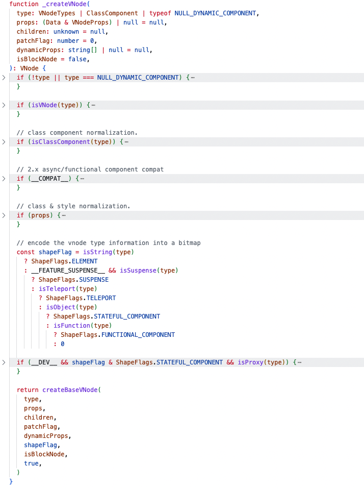
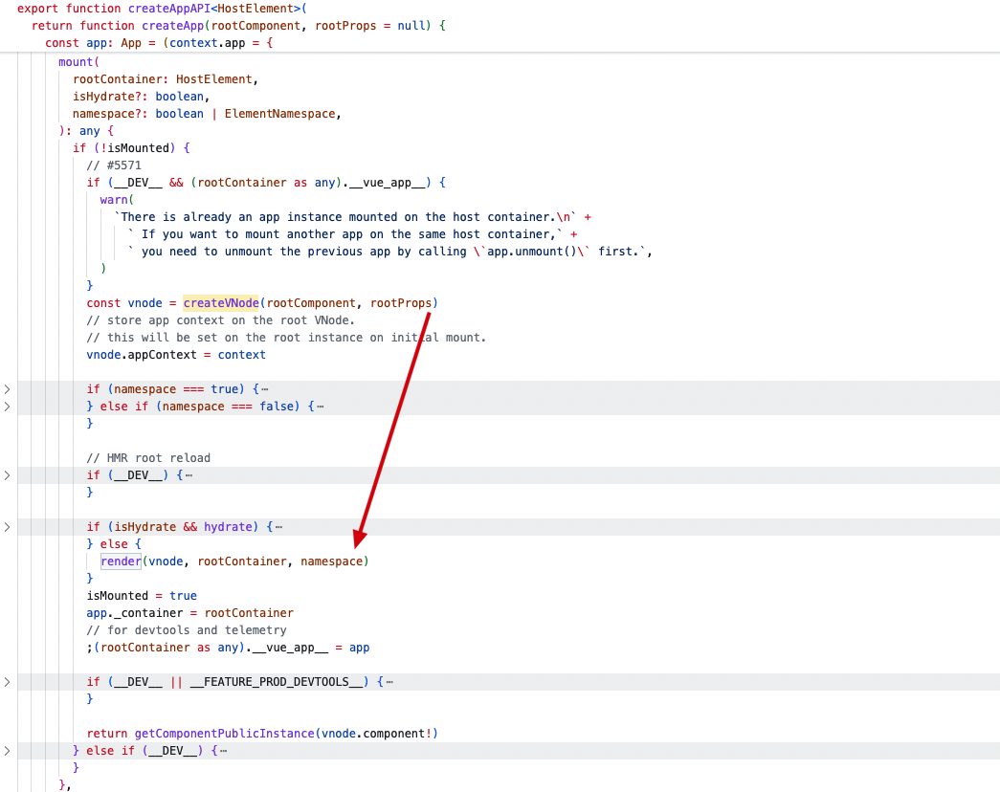
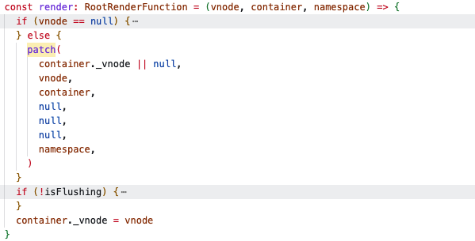
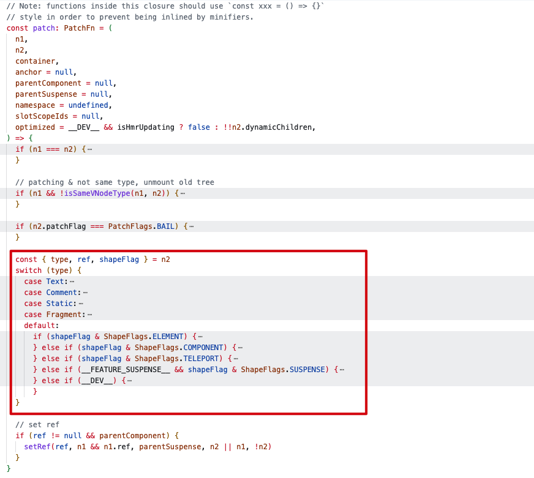

# 渲染机制

Vue 组件挂载要经过：编译、挂载、更新


## 编译

在编译过程中 Vue 模板会被编译成**渲染函数**：即返回虚拟 DOM 树的函数。

编译过程主要包括：

- 解析模板(parse)：将模板字符串转为 AST 语法树
- 转化 AST 抽象语法树(transform)
- 生成渲染函数(generate)

> 抽象语法树 AST 是一种表示源代码结构的数据结构，以树的形式捕获编程语言的语法结构。

在 Vue3 中， [`complier-core`](https://github.com/vuejs/core/blob/main/packages/compiler-core/src/compile.ts#L65) 负责核心编译相关能力。

```js
export function baseCompile(
  source: string | RootNode,
  options: CompilerOptions = {}
): CodegenResult {
  ...
  const ast = isString(source) ? baseParse(source, resolvedOptions) : source;
  ...
  transform(
    ast,
    extend({}, resolvedOptions, {
      nodeTransforms: [
        ...nodeTransforms,
        ...(options.nodeTransforms || []), // user transforms
      ],
      directiveTransforms: extend(
        {},
        directiveTransforms,
        options.directiveTransforms || {} // user transforms
      ),
    })
  );

  return generate(ast, resolvedOptions);
}
```

### 解析模板，生成 AST --- baseParse

当组件实例初始化时，会将模板传入 Vue 编译器进行编译。在这个过程中会将模板字符解析成一个抽象语法树（Abstract Syntax Tree）。

> Vue 引用了 `htmlparser2` 的第三方库来解析模板，在源码中被定义为 `Tokenizer`。它将模板中的**指令**和**属性**转换为对应的 AST 节点。

### 转化 AST --- transform

在生成 AST 后会调用 `transform` 函数，对 AST 进行优化。这一阶段包括**静态节点的识别**、表达式的缓存等等，目的是为了减少运行时的计算量，提高渲染性能。

##### 静态提升

静态提升是一种模板编译优化策略，用于减少每次渲染时创建的虚拟 DOM 节点数量，从而提升性能。

当模板中的某些部分是静态的会在 AST 中添加一个静态标记。

```html
<div>
  <div>foo</div>
  <!-- 需提升 -->
  <div>bar</div>
  <!-- 需提升 -->
  <div>{{ dynamic }}</div>
</div>
```

`foo` 和 `bar` 这两个 div 是完全静态的，没必要在重新渲染时再次创建和对比他们。

Vue 编译器会自动的提升这部分 vnode 创建函数到这个模板的渲染函数之外，并在每次渲染时都使用这份相同的 vnode，渲染器知道新酒 vnode 着部分完全相同的，所以完全跳过对他们的差异对比。

##### 更新类型标记

对于单个有动态绑定的元素来说，我们可以在编译时推断出大量信息：

```html
<!-- 仅含 class 绑定 -->
<div :class="{ active }"></div>

<!-- 仅含 id 和 value 绑定 -->
<input :id="id" :value="value" />

<!-- 仅含文本子节点 -->
<div>{{ dynamic }}</div>
```

在为这些元素生成渲染函数时，Vue 在 vnode 创建调用中直接编码了每个元素所需的更新类型：

```js
createElementVNode(
  "div",
  {
    class: _normalizeClass({ active: _ctx.active }),
  },
  null,
  2 /* CLASS */
);
```

最后这个参数 2 就是一个更新类型标记 (patch flag)。一个元素可以有多个更新类型标记，会被合并成一个数字。运行时渲染器也将会使用位运算来检查这些标记，确定相应的更新操作：

```js
if (vnode.patchFlag & PatchFlags.CLASS /* 2 */) {
  // 更新节点的 CSS class
}
```

位运算检查是非常快的。通过这样的更新类型标记，Vue 能够在更新带有动态绑定的元素时做最少的操作。

### 生成渲染函数 --- generate

## 挂载

在组件挂载阶段，Vue 会调用 `render` 函数，生成虚拟 DOM 树，并基于它创建真实 DOM 树。

#### 创建 vnode



`_createVNode` 函数是创建虚拟 DOM 节点的核心方法，处理了多种类型的组件和属性，确保 VNode 正确构建。

#### 首次调用



首次挂载时调用 `createVNode` 函数，传入跟组件，创建虚拟 DOM 节点，调用 `render` 函数。



`render` 函数中如果传入 `vnode` 进入 `patch` 调用，`patch` 将虚拟 DOM 转化为真实 DOM。



`patch` 方法会根据不同 `type` 类型进行相应处理，在初始化渲染根节点时进入`processComponent` 方法。最终会调用 `setupRenderEffect` 方法，将 `render` 函数返回的 `vnode` 渲染成真实 DOM。`

## 更新

当一个依赖发生变化后，副作用会重新运行，这是会创建一个更新后的虚拟 DOM 树。运行时渲染器遍历这颗新树，将它与旧树比较，然后将必要的更新应用到真实 DOM 树上。
