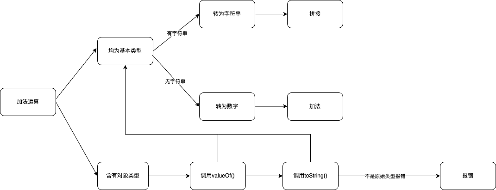

## 加法问题


均为基本类型  
```javascript
1 + 2; // 3
true + 1; // 2
false + false; // 0
1 + NaN; // NaN

"foo" + "bar"; // "foobar"
5 + "foo"; // "5foo"
"foo" + false; // "foofalse"
"2" + 2; // "22"
"foo" + NaN; // "fooNaN"
```

含对象
```javascript
// [1, 2].toString() => "1, 2"
[1, 2] + 1; // "1,21"
[1, 2] + [1]; // "1,21"
[1] + true; // "1true"

// obj.toString() => "[object Object]"
const obj = {a: 1}
obj + 1; // "[object Object]1"
obj + {b: 2}; // "[object Object][object Object]"
obj + [1, 2]; // "[object Object]1, 2"

```