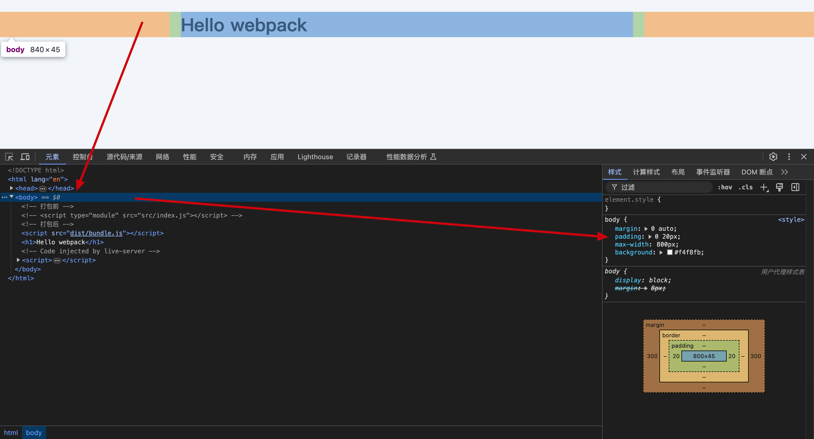
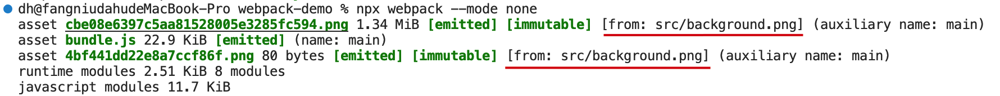

# webpack

## 快速上手 webpack

准备一个文件

```bash
mkdir webpack-demo
cd webpack-demo
npm init -y
npm install webpack webpack-cli --save-dev
```

文件目录

```
webpack-demo
|- package.json
|- package-lock.json
|- index.html
|- /src
  |- index.js
  |- heading.js
```

运行命令

```bash
npx webpack
```

Webpack会尝试读取项目中的Webpack**配置文件**（默认为webpack.config.js），并根据配置文件中的设置来执行打包操作。如果没有找到配置文件，Webpack会尝试使用其**内置的默认配置**（默认读取 ./src/index.js 文件）。

执行结果：


执行结果含义：

- `asset main.js 195 bytes [emitted] [minimized] (name: main)`：表示构建了一个名为 main.js 的输出文件，大小为 195 字节。`emiitted` 表示已经输出到目标目录。`minimized` 表示该文件经过了压缩。
- `orphan modules 206 bytes [orphan] 1 module`：表示有 1 个孤儿模块（没有被任何输出文件所引用），大小为 206 字节。
- `./src/index.js + 1 modules 291 bytes [built] [code generated]`：表示 inedx.js 和 另一个模块被一起构建了，大小为 291 字节。`built` 表示已经编译过了。`code generated` 表示已经生成了代码。

## 配置文件 webpack.config.js

webpack v4 以后的版本无须任何配置即可运行，然而大多数项目会需要很复杂的设置，因此 webpack 仍然支持 配置文件，这比在终端中手动输入大量命令更加高效。接下来创建一个 webpack 配置文件：

```js
const path = require('path')

module.exports = {
  entry: './src/index.js', // 入口文件
  output: {
    filename: 'bundle.js', // 输出文件名
    path: path.join(__dirname, 'dist'), // 输出文件路径
  },
}
```

## 打包模式

在上一节运行 `npx webpack` 命令，控制台有一个警告。


意思是 `mode` 配置项没有被设置，默认为 `production`。建议设置为 `development` 或者 `production`。也可以设置 `none`，表示不使用任何默认配置。

下面分别介绍一下这三种模式

### 开发模式 development

使用 `npx webpack --mode development` 或者在 `webpack.config.js` 中配置 `mode: 'development'`。

这种模式主要用于开发环境，启动一些有助于开发的功能，例如增强的错误堆栈、模块热替换（Hot Module Replacement）等。

开发模式下，webpack不会对代码进行压缩，以便于调试。

执行结果：


执行结果含义：

- `asset bundle.js 4.39 KiB [emitted] (name: main)`：***注意 !!*** 这里就没有 `[minimized]` 了，因为开发模式不会对代码进行压缩，所以 bundle.js 文件也要比之前大很多。
- `runtime modules 670 bytes 3 modules`：这行说明Webpack在打包过程中生成了3个运行时模块（runtime modules），这些模块的总大小为670字节。
- `cacheable modules 291 bytes`：表示Webpack在处理过程中遇到了291字节的可缓存模块。这通常指的是源代码文件，Webpack会尝试缓存这些文件的处理结果，以便在下次构建时加快构建速度。

### 生产模式 production

使用 `npx webpack --mode production` 或者在 `webpack.config.js` 中配置 `mode: 'production'`。

生产模式是为部署到生产环境设计的，它会启用一系列的优化措施，如代码压缩、模块标识的混淆、Tree Shaking 等，以减少最终输出文件的大小，提高加载速度和性能。

此模式下，Webpack 还会移除所有的开发环境的警告和调试信息，只保留必要的运行时代码。

### 无模式 none

使用 `npx webpack --mode none` 或者在 `webpack.config.js` 中配置 `mode: 'none'`。

当你在 Webpack 配置中不指定模式时，默认情况下 Webpack 不会应用任何预设的优化。

这种情况下，Webpack 的行为是最基础的，不会进行特别的代码分割、压缩或其他针对生产或开发环境的优化。

> 实际项目中，通常会结合使用不同配置文件来区分开发和生产环境，例如 `webpack.dev.js` 和 `webpack.prod.js`

## loader

Webpack 的 loader 是一个用于处理各种**不同类型文件**的转换器。loader 可以将任何类型的文件转换为 webpack 能够处理的有**效模块**，然后你就可以像处理其他模块一样使用它们。

### 样式资源加载 css-loader 与 style-loader

要想在 JavaScript 模块中导入 CSS 文件，需要安装 `style-loader` 和 `css-loader`，并在 module 配置 中添加这些 loader：

```js
...
module.exports = {
  ...
  module: {
    rules: [
      {
        test: /\.css$/, // 匹配css文件
        use: ['style-loader', 'css-loader'],
      },
    ],
  },
}
```

module loader 可以**链式调用**。链中的每个 loader 都将对资源进行转换，不过链会**逆序执行**（从后向前执行）。第一个 loader 将其结果（被转换后的资源）传递给下一个 loader，依此类推。最后，webpack 期望链中的最后的 loader 返回 JavaScript。

webpack loader解析是从后向前执行的，所以要确保 `style-loader` 在 `css-loader` 前面。因为 `css-loader` 负责解析 CSS 文件，转化为相应的的模块引用。`style-loader` 负责将 CSS 模块插入到 DOM 中。

执行结果如图：



---
> rules 数组中的对象的属性：
>
> test：匹配要处理的文件，是一个正则表达式
>
> use：一个数组或者字符串，包含要使用的 loader，loader 的执行顺序是从右到左的。

### 文件资源加载 file-loader 与 url-loader

在 **webpack5 之前**通常使用 `file-loader` 和 `url-loader` 都能用于处理文件资源。

`file-loader` 会将文件复制到输出目录，并返回文件路径。这对较大文件来说非常有用，因为它们不会被嵌入到构建产物中，而是作为独立的文件存在

`url-loader` 会将文件转换为 base64 编码的字符串，并返回 base64 编码的字符串。对较小的文件（小于 limit 属性值）很有用，因为它们可以减少 HTTP 请求的数量，从而提高性能。

更新配置项

```js
module.exports = {
  module: {
    rules: [
      ...,
      {
        test: /\.(png|jpe?g|gif|svg)$/i,
        use: [
          {
            loader: 'url-loader',
            options: {
              limit: 8192, // 8KB以下的文件将被转换为Data URL
            },
          },
        ],
      },
    ]
  }
}
```

实际操作过程中遇到了一个问题，通过 css 样式设置的背景图打包之后生成了两张，其中一张损坏并且页面无法正常显示。

```css
body {
  min-height: 100vh;
  background: #f4f8fb;
  background-image: url(background.png);
  background-size: cover;
}
```

终端提示：



原因：[https://blog.csdn.net/Coralpapy/article/details/119419137](https://blog.csdn.net/Coralpapy/article/details/119419137)

根据上边这篇博客，我在[官方文档](https://www.webpackjs.com/guides/asset-modules#root)中发现，webpack5 内置了 `asset module`，允许使用资源文件，无需配置额外loader。


删除 `file-loader` 和 `url-loader` 的配置项后就可以正常运行了

```js
module.exports = {
  module: {
    rules: [
      ...,
      {
        test: /\.(png|jpe?g|gif|svg)$/i,
        type: 'asset/resource',
        // webpack5 内置了 asset module；webpack4.x 版本需要配置
        // use: [
        //   {
        //     loader: 'url-loader',
        //     options: {
        //       limit: 8192, // 8KB以下的文件将被转换为Data URL
        //     },
        //   },
        // ],
      },
    ]
  }
}
```

### ES6 -> ES5 babel-loader

webpack 不会自动编译 ES6 代码，需要使用 `babel-loader` 来转换。

打包输出文件 bundle.js 部分截图


如上图所示，`const`、箭头函数等语法并没有转化为 ES5的写法。

安装相关依赖

```bash
npm install --save-dev babel-loader @babel/core @babel/preset-env
```

更新配置文件

```js
...
module.exports = {
  ...
  module: {
    rules: [
      ...
      {
        test: /\.js$/,
        use: {
          loader: 'babel-loader',
          options: {
            presets: ['@babel/preset-env'], // 预设
          },
        },
      },
    ],
  },
}
```

- `babel-loader`：读取每个 .js 文件，并调用 `@babel/core` 来进行编译，将 ES6 语法编译为 ES5 语法。
- `@babel/core`：Babel 的核心库，负责编译 ES6 语法。
- `@babel/preset-env`：Babel 的预设，包含了所有 ES6 语法的编译规则。它基于目标浏览器的支持情况，智能地选择哪些插件（plugins）需要被激活，以转换那些不被目标环境支持的语法。确保你的代码只转换为确实需要的部分，避免不必要的转换，这有助于保持代码的简洁性和性能。

重新打包编译生成 bundle.js 文件，截图如下：


可以看到，`const`、箭头函数等语法已经转化为 ES5的写法。

### html-loader

将 HTML 导出为字符串。当编译器需要时，将压缩 HTML 字符串。

更新 `webpack-config.js` 配置文件

```js
...
module.exports = {
  ...
  module: {
    rules: [
      ...
      {
        test: /.html$/,
        use: {
          loader: 'html-loader',
        },
      },
    ],
  },
}
```

新增文件 `footer.html`

```html
<footer>
  
  <a href="better.png">download png</a>
</footer>
```

打包编译后，img 标签可以正常显示，a 标签访问提示 404。根据官方文档 html-loader 的 [source](https://www.webpackjs.com/loaders/html-loader/#sources) 配置项描述，a 标签 href 属性默认是不自动处理的，要手动添加。

更新 `webpack-config.js` 配置文件

```js
module.exports = {
  ...
  module: {
    rules: [
      ...
      {
        test: /.html$/,
        use: {
          loader: 'html-loader',
          options: {
            sources: {
              list: [
                { tag: 'img', attribute: 'src', type: 'src' },
                { tag: 'a', attribute: 'href', type: 'src' },
              ],
            },
          },
        },
      },
    ],
  },
}
```

## Plugin

### clean-webpack-plugin

`clean-webpack-plugin` 的主要作用是在每次构建开始前清理输出目录，确保没有旧的构建文件残留，这对于避免文件冲突和确保构建的一致性非常重要。

安装依赖 `npm install --save-dev clean-webpack-plugin`

更新 `webpack-config.js` 配置文件

```js
...
const { CleanWebpackPlugin } = require('clean-webpack-plugin')

module.exports = {
  ...
  plugins: [new CleanWebpackPlugin()],
}
```

重新执行 `npx webpack --mode none` 原先 dist 目录下的文件已经被删除，生成了新的文件。

### html-webpack-plugin

`html-webpack-plugin` 是一个用于 HTML 文件的插件，它允许你使用简单的模板语法，生成带有自动插入的 webpack 构建文件的 HTML 文件。

安装依赖 `npm install --save-dev html-webpack-plugin`

更新 `webpack-config.js` 配置文件

```js
...
const HtmlWebpackPlugin = require('html-webpack-plugin')

module.exports = {
  ...
  plugins: [
    new HtmlWebpackPlugin({
      template: './index.html', // 模板文件
    }),
  ],
}
```

重新执行 `npx webpack --mode none`，终端提示 index.html 文件生成成功。


### copy-webpack-plugin

`copy-webpack-plugin` 是一个用于复制文件到输出目录的插件。

安装依赖 `npm install --save-dev copy-webpack-plugin`

更新 `webpack-config.js` 配置文件

```js
...
const CopyWebpackPlugin = require('copy-webpack-plugin')

module.exports = {
  ...
  plugins: [
    ...
    new CopyWebpackPlugin({
      patterns: [
        {
          from: path.resolve(__dirname, 'public'), // 从根目录下的 public 文件夹
          to: path.resolve(__dirname, 'dist'), // 到 dist 目录
        },
      ],
    }),
  ],
}

```

重新打包生成 dist 目录，public 目录下的文件被复制到 dist 目录下。

终端提示：`asset favicon.ico 4.19 KiB [emitted] [from: public/favicon.ico] [copied]`：favicon.icon 文件已经从 public 目录下被复制到 dist 目录下。


## 开发体验

每次更改完源代码都要重新打包，非常麻烦，需要优化开发体验。

### watch

`watch` 配置项用于开启文件监听，当文件发生改变时，会自动重新编译。

可以通过 CLI 命令 `npx webpack --watch` 开启监听，也可以在配置文件中添加 `watch: true` 配置项。

```js
module.exports = {
  // ...
  watch: true,
  watchOptions: {
    ignored: /node_modules/, // 忽略不需要监听的文件夹
    aggregateTimeout: 300, // 文件变化的聚合时间
    poll: 1000 // 检查文件变化的间隔时间，单位毫秒
  }
};
```

### webpack-dev-server

`webpack-dev-server` 是一个基于 Node.js 的HTTP服务器。它提供了一下主要功能：

1. 静态资源服务：`webpack-dev-server` 可以作为一个静态文件服务器，用于提供 HTML 文件和其他静态资源。它会监听指定的端口并根据 webpack 的配置来处理请求。可以通过 `contentBase` 配置项来指定静态资源的目录。
2. 实时编译与热更新：当源代码发生更改时，`webpack-dev-server` 会触发 webpack 重新编译项目。这通常通过 watch 模式实现，它可以监听文件系统的变化。
3. 代理请求：`webpack-dev-server` 可以代理请求，用于解决跨域问题。

安装依赖 `npm install --save-dev webpack-dev-server`。启动服务 `npx webpack-dev-server` ，终端提示如图


意思是项目已经运行在本地地址 <http://localhost:8080/> 上，IPv4 地址上是xxx，IPv6 地址上是xxx。`webpack-dev-server` 正在从指定的目录服务获取静态资源，而不是通过 webpack 构建的。

此时 dist 目录下面是没有任何文件输出的。因为 `webpack-dev-server` 将构建结果保存在内存中，并通过 HTTP 服务器提供动态内容。这种机制允许它在代码更改时快速地重新编译，并利用热模块替换（Hot Module Replacement, HMR）来更新浏览器中的模块，而无需重新加载整个页面。

#### 手动配置 webpack-dev-server 解决跨域问题

参照 webpack4.x 教程配置是这样的

```js
...
module.exports = {
  ...
  devServer: {
    contentBase: './public', // 静态资源目录
    port: 3000,
    open: true,
    proxy: {
      '/api': {
        // 匹配所有以 /api 开头的请求，http://localhost:3000/api/user => https://api.github.com/api/user
        target: 'https://api.github.com', // 目标域名
        secure: true, // 如果目标是 https 设置为 true
        changeOrigin: true, // 如果目标域名与当前域名不同，设置为 true
        pathRewrite: { '^/api': '' }, // 移除代理前缀，使请求到达目标服务器时没有 /api
      },
    },
  },
}

```

我使用的 webpack 和 webpack-cli 都是 5.x 版本，按照上面配置编译后控制台报错如下


有两个问题：

第一个是说配置相当中没有 `contentBase` 属性了，然后它列举了现在配置相当中合法的属性，这里要使用的是 `static` 属性；

第二个是说 配置项 proxy 应该是个数组，数组里面可以存放对象或着方法。内部的写法也有些变化，所以按照 webpack5 的要求配置应该这样的：

```js
...
module.exports = {
  ...
  devServer: {
    static: {
      directory: path.join(__dirname, 'public'),
    }, // 静态资源目录
    port: 3000,
    open: true,
    proxy: [
      {
        context: ['/api'],
        // 匹配所有以 /api 开头的请求，http://localhost:3000/api/user => https://api.github.com/api/user
        target: 'https://api.github.com', // 目标域名
        secure: true, // 如果目标是 https 设置为 true
        changeOrigin: true, // 如果目标域名与当前域名不同，设置为 true
        pathRewrite: { '^/api': '' }, // 移除代理前缀，使请求到达目标服务器时没有 /api
      },
    ],
  },
}

```

### source-map

Webpack 的 source map 功能主要用于在开发和调试过程中帮助开发者追踪原始源代码中的错误和警告，而不是在构建后的代码中查找。

打开浏览器控制台，切换到 source 栏可以看到现在源代码指向的都是打包后的文件，这对于调试工作很不友好。


利用 source map 可以解决这个问题，它是一种映射关系，将编译后的代码行和列映射回原始代码。当浏览器控制台报错或者警告时，会使用 source map 来定位到原始代码的位置。

更新 `webpack-config.js` 配置项，添加 `devtool: 'source-map'`

```js
...
module.exports = {
  ...
  devtool: 'source-map',
  ...
}
```

运行 `npx webpack-dev-server` 命令，在浏览器控制台查看报错信息，可以看到报错信息指向了原始源代码的位置。


---

Webpack 支持多种类型的 source map，[官方文档](https://www.webpackjs.com/configuration/devtool/#devtool)中详细介绍了他们之间在性能、是否可用于生产环境、质量和使用建议。

- eval 类型：生成的 source map 会嵌入到每个模块的 eval 函数中，适用于快速开发和测试，但不适用于生产环境。
- cheap 类型：不包括列映射或源映射，仅包括行映射，这使得构建更快，但可能无法精确到列。
- module 类型：仅包括模块级别的映射，不包括外部资源如图片或字体文件。
- nosources 类型：不包含源代码，仅包含映射信息，这可以防止源代码泄漏给客户端。

推荐使用 `cheap-module-source-map` 类型，因为它在性能和调试方面都有很好的平衡。

### HMR Module Replacement 热模块替换

HMR 它能帮助在运行时不完全刷新页面的情况下更新所有类型的模块。`webpack-dev-server` 默认内置了 HMR 插件。

为了测试 热替换 的特性，在页面中创建一个区域，可以输入内容。

此时修改 .css 文件，页面不会刷新，但是样式会更新。修改 .js 文件，页面会刷新。

如果想要 .js 文件不刷新，需要使用在相应的 .js 文件做些处理。但是这种手动处理很麻烦，建议采用一些集成的框架。

## 不同环境下的打包配置

创建三个文件用于配制不同环境：`webpack-dev.js`、`webpack-prod.js`、`webpack-common.js`

通过 `npx webpack --config xxx.js` 命令打包不同环境。

## webpack.DefinePlugin

webpack.DefinePlugin 是 Webpack 的一个内置插件，用于在编译时注入全局常量。

这些常量可以在 JS 代码中被引用，他们在编译阶段被替换为预定义的值，而不是在运行时动态计算。

对于去分开发环境和生产环境很有用。

更改 `webpack-config.js` 配置文件，添加 `webpack.DefinePlugin` 插件。

```js
...
const webpack = require('webpack')

module.exports = {
  ...
  plugins: [
    new webpack.DefinePlugin({
      'process.env.NODE_ENV': JSON.stringify(
        process.env.NODE_ENV || 'development'
      ),
      IS_DEV: process.env.NODE_ENV === 'development',
    }),
  ],
}

```

在 package.json 的 script 属性中添加 `"dev": "NODE_ENV=development npx webpack-dev-server"` 命令，这样在运行 `npm run dev` 命令时就会设置 `NODE_ENV` 为 `development`。

运行 `npm run dev`，通过 `IS_DEV` 判断是否为开发环境。

## optimization 优化

### Tree Shaking

Tree Shaking 是一个术语，用于描述在 JavaScript 模块化系统中，当编译器检测到模块中未被引用的代码时，可以删除该代码。

在 webpack 中 生产模式时 Tree Shaking 会自动开启。也可以通过 `optimization.usedExports` 配置项开启。

```js
module.exports = {
  //...
  optimization: {
    usedExports: false,
  },
};
```

Tree Shaking 是利用 ES6 的静态分析功能，通过分析模块的引用关系，去除未使用的代码。之前有说法 Tree Shaking 和 babel loader 会冲突。

babel loader 是处理 ES6 语法的，当使用 preset 时指定将 ES Module 转化为 CommonJS 语法，所以 babel loader 和 Tree Shaking 会冲突。

但是在 webpack 4之后，@babel/preset-env 默认以 ES Module 作为输入，所以不会和 Tree Shaking 冲突。

### concatenateModules 模块合并

通过将多个模块的函数调用合并成一个大的函数调用。减少函数调用的开销和生成的代码量。

在 webpack 中 生产模式时 concatenateModules 会自动开启。也可以通过 `optimization.concatenateModules` 配置项开启。

```js
module.exports = {
  //...
  optimization: {
    concatenateModules: true,
  },
};
```

### sideEffects 模块副作用

sideEffects 选项是用来告知 Webpack 某个模块是否具有副作用。

副作用指的是在模块导入时发生的除了返回其导出值之外的任何行为，例如修改全局变量、执行 I/O 操作、注册事件监听器等。

当 Webpack 进行 Tree Shaking 时，它首先会检查该模块是否具有副作用。如果模块具有副作用，那么 Webpack 会将整个模块作为依赖项添加到构建结果中，即使该模块没有被其他模块引用。

在 package.json 中配置 sideEffects 属性，可以指定哪些模块具有副作用。

```json
// 所有模块都没有副作用
{
  ...
  "sideEffects": false
}
```

```json
// 某个模块都有副作用
{
  ...
  "sideEffects": ["./src/someFileWithSideEffects.js"]
}
```

### Code Splitting 代码分割

将代码分割成多个小块，然后按需加载或预加载这些块。

在没有代码分割的情况下，Webpack 会将所有模块打包成一个或几个较大的文件。当用户访问时需要下载整个文件，即使可能只需要其中的一小部分功能。这样会导致不必要的网络延迟和资源浪分

### 多入口

Webpack 中可以配置多个入口，每个入口对应一个或多个 JS 文件，从而创建多个独立输出文件。对于构建多个页面或模块化得大型应用非常有用，每个模块页面都有自己的入口文件。

通过 `entry` 配置项指定多个入口文件，每个入口文件对应一个输出文件。

下面是一个配置多入口文件的例子：

```js
const { CleanWebpackPlugin } = require('clean-webpack-plugin')
const HtmlWebpackPlugin = require('html-webpack-plugin')

module.exports = {
  mode: 'none',
  entry: {
    index: './src/index.js',
    album: './src/album.js'
  },
  output: {
    filename: '[name].bundle.js' // 输出文件名
  },
  module: {
    rules: [
      {
        test: /\.css$/,
        use: [
          'style-loader',
          'css-loader'
        ]
      }
    ]
  },
  plugins: [
    new CleanWebpackPlugin(),
    new HtmlWebpackPlugin({
      title: 'Multi Entry',
      template: './src/index.html',
      filename: 'index.html',
      chunks: ['index'] // 只包含来自 index 入口的 chunk 
    }),
    new HtmlWebpackPlugin({
      title: 'Multi Entry',
      template: './src/album.html',
      filename: 'album.html',
      chunks: ['album'] // 只包含来自 about 入口的 chunk
    })
  ]
}

```

### splitChunks 代码分割

Webpack 的 splitChunks 选项允许将公共模块（例如 React、jQuery 等）提取到单独的 chunk 中，从而减少重复的代码。

### 按需加载
