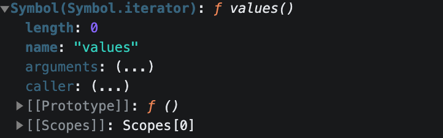

# ECMAScript
ECMAScript，简称为 ES，是 JavaScript 语言的基础规范，由 ECMA 国际（European Computer Manufacturers Association）制定和维护。ECMAScript 规范定义了 JavaScript 的语法和基本对象，但不包括 DOM（Document Object Model）、BOM（Browser Object Model）或其他浏览器相关的 API，这些通常被认为是 JavaScript 的一部分，但实际上是由 W3C 和其他组织定义的。

## Proxy 代理对象
Proxy 对象用于创建一个对象的代理，从而实现基本操作的拦截和自定义（如属性查找、赋值、枚举、函数调用等）。

Proxy VS Object.defineProperty 的优势：
- Proxy 可以检测数组的变化；
- proxy 以非侵入的方式监听数组的读写；

## Reflect
Reflect 是ES6 引入的内置对象，提供了**统一**操作对象的API。
```js
const obj = {
  name: 'dahu',
  age: 18,
  height: 1.88,
}

// 以前的写法：要用到操作符、object 的方法
console.log('name' in obj)
console.log(delete obj.age)
console.log(Object.keys(obj))

// MDN 主推 Reflect
console.log(Reflect.has(obj, 'name'))
console.log(Reflect.deleteProperty(obj, 'age'))
console.log(Reflect.ownKeys(obj))
```

Reflec 成员方法就是 Proxy 处理对象的默认实现。

比如：创建一个Proxy对象，如果没有提供 get 方法，当尝试访问这个 Proxy 上的属性时，Proxy 就会调用 `Reflect.get()` 方法来获取属性值。
```js
const p1 = new Proxy({}, {})

// 相当于
const p = new Proxy({}, {
  get(target, property) {
    return Reflect.get(target, property)
  }
})
```

## Class 类

## Set 集合
Set 对象是一个内置全局对象，用于存储唯一的元素集合。Set中的元素按插入顺行排列，并且不允许重复值。
```js
const set = new Set()

set.add(1).add(2).add(3).add(4).add(2) // 添加元素，重复元素不会被添加
console.log(set, set.size, set.has(2)) // Set(4) {1, 2, 3, 4} 4 true

set.delete(1) // 删除元素
console.log(set) // Set(3) {2, 3, 4}

set.clear() // 清空集合
console.log(set) // Set(0) {}
```
过滤数组重复项
```js
const arr = [ 1, 2, 3, 4, 5, 1, 2, 3, 4, 5 ]
const uniqueArr = Array.from(new Set(arr))
```

## Map 映射
Map 对象保存键值对，并且能够记住键的原始插入顺序。任何值（对象或者原始值）都可以作为一个键或一个值。

Map vs Object：Map 可以使用**任何类型作为键**，键可以是任意类型的值，包括函数、对象、数组等。Object 的键只能**是字符串或者 Symbol**，如果是其他数据结构，会调用 `toString()` 方法自动转为字符串。
```js
const obj = {
  true: 'value',
  123: 'value',
  [{ a: 1 }]: 'value',
}
console.log(Object.keys(obj)) // [ 'true', '123', '[object Object]' ]

const map = new Map()
map.set(true, 'value')
map.set(123, 'value')
map.set([{ a: 1 }], 'value')
console.log(map.keys()) // [Map Iterator] { true, 123, [ { a: 1 } ] }
```

## Symbol 符号
Symbol 是一种新的原始数据类型，用于独一无二的值，主要用作对象的键名，确保键名唯一性。

如果需要复用同一个 Symbol，使用 `Symbol.for()`方法。
```js
console.log(Symbol('foo') === Symbol('foo')) // false
console.log(Symbol.for('foo') === Symbol.for('foo')) // true
console.log(Symbol.for(true) === Symbol.for('true')) // true
```

`Symbol.toStringTag`：用于自定义对象的默认字符串描述。
```js
const obj = {
  [Symbol.toStringTag]: 'XObject',
}
console.log(obj.toString()) // [object XObject]
```

## iterator 迭代器
`for...of` 循环可以遍历**可迭代对象**。可迭代对象包括数组、字符串、Map、Set、arguments 以及任何实现了可迭代协议 Iterable 的自定义对象。
```js
// 遍历数组
const arr = [100, 200, 300, 400, 500]
for (let item of arr) {
  console.log(item)
  if (item > 300) {
    break
  }
}

// 遍历Set
const s = new Set([100, 200, 300, 400, 500])
for (let item of s) {
  console.log(item)
}

// 遍历Map
const m = new Map()
m.set('name', '张三')
m.set('age', 18)
m.set('height', 1.88)
for (let [key, value] of m) {
  console.log(key, value)
}

// for of 循环不能遍历对象
// const obj = { foo: 123, bar: 456 }
// for (const item of obj) {
//   console.log(item)
// }
```
所有可迭代对象都有 `Symbol.iterator` 属性，该属性是一个函数，调用该函数返回一个迭代器对象。
```js
const arr = [100, 200, 300, 400, 500]
const iterator = arr[Symbol.iterator]()
iterator.next() // { value: 100, done: false }
```



### 实现 iterator 迭代器
```js
const todos = {
  life: ['吃饭', '睡觉', '打豆豆'],
  work: ['喝咖啡', '写代码', '休息'],

  each: function (callback) {
    const all = [...this.life, ...this.work]
    for (const item of all) {
      callback(item)
    }
  },

  [Symbol.iterator]: function () {
    const all = [...this.life, ...this.work]
    let index = 0
    return {
      next: () => ({
        value: all[index++],
        done: index >= all.length,
      }),
    }
  },
}

todos.each((item) => console.log(item))
for (const item of todos) {
  console.log(item)
}
```
可以直接调用 todos 的`Symbol.iterator`属性，当内部属性发生变化时无需更改业务代码。

## Generator 生成器
生成器是一个函数，可以暂停执行和恢复执行，并且能够保存变量的上下文。
