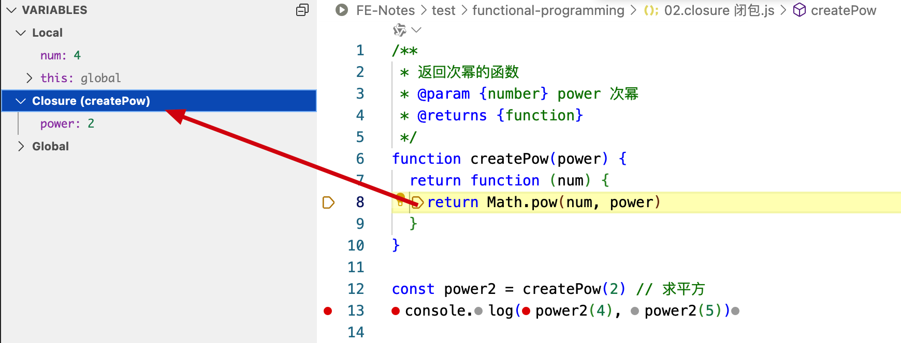

# 函数式编程

函数式编程（Functional Programming）是一种编程范式，把程序看作由一系列函数组成，根据输入通过某种运算获得相应的输出。

```javascript
// 非函数式
let n1 = 2
let n2 = 3
let sum = n1 + n2
console.log(sum)

// 函数式
function add(n1, n2) {
  return n1 + n2
}
console.log(add(2, 3))
```

## 函数是一等公民

在函数式编程中，函数是一等公民，意味着函数可以：

- 存储在变量中
- 作为参数传递
- 作为返回值
- 存储在数据结构中
- 拥有属性和方法
  
```javascript
// 把函数赋给变量
let fn = function() {
  console.log('Hello First-class Function')
}
fn()

// 示例
const BigController = {
  index(posts) { return Views.index(posts) },
  show(post) { return Views.show(post) },
  create(attrs) { return Db.create(attrs) }
}

// 优化写法
const BigController = {
  index: Views.index,
  show: Views.show,
  create: Db.create
}
BigController.index(posts)
BigController.show(post)
BigController.create(attrs)
```

## 高阶函数 Higher-order function

满足函数作为**参数传递**，或者作为**返回值**，任意一种都属于高阶函数。

### 函数作为参数传递

```javascript
// 模拟 Array.forEach 方法
function myForEach(arr, fn) {
  for (let i = 0; i < arr.length; i++) {
    fn(arr[i])
  }
}

// 模拟 Array.filter 方法
function myFilter(arr, fn) {
  const result = []
  for (let i = 0; i < arr.length; i++) {
    if(fn(arr[i])) {
      result.push(arr[i])
    }
  }
  return result
}

const arr = [1, 2, 3, 4, 5]
arr.forEach(arr, (item) => item * 3) // [3, 6, 9, 12, 15]
const tempArr = arr.filter(arr, (item) => item % 2 === 0) 
console.log(tempArr) // [12]
```

### 函数作为返回值

```javascript
// 简单示例
function makeFn() {
  const msg = 'Hello Higher-order function'
  return function() {
    console.log(msg)
  }
}
const fn = makeFn()
fn()

// 模拟 jQuery once 方法，绑定一个元素处理器，处理器只会被执行一次
function once(fn) {
  let done = false
  return function () {
    if (!done) {
      done = true
      return fn.apply(this, arguments)
    }
  }
}

const pay = once((money) => `支付了${money}元`)
let result1 = pay(10)
let result2 = pay(20)
let result3 = pay(30)
console.log(result1, result2, result3) // 支付了10元 undefined undefined
```

高阶函数的意义：**运算的缺失和延续**

## 闭包 Closure

闭包：函数和其周围的状态（词法环境）的引用捆绑在一起形成闭包。通俗的说：**一个函数有权访问另一个函数作用域中的变量**，即使在外部函数已经执行结束。

```js
/**
 * 返回次幂的函数
 * @param {number} power 次幂
 * @returns {function}
 */
function createPow(power) {
  return function (num) {
    return Math.pow(num, power)
  }
}

const power2 = createPow(2) // 求平方
console.log(power2(4), power2(5))
```

nodejs断点调试



闭包的本质：函数在执行的时候会被放到一个执行栈中，当函数执行完毕之后，会从栈中移除。但是**堆上的作用域的成员因为被外部引用不能释放**，所以内部函数依然可以访问外部函数的成员。

## 纯函数

纯函数：相同的输入始终返回相同的输出值，而且没有任何可观察的**副作用**。

```js
const arr = [1, 2, 3, 4, 5]

// 纯函数：相同的输入得到相同的输出
const a1 = array.slice(0, 3);
const a2 = array.slice(0, 3);
console.log(a1, a2) // [1, 2, 3] [1, 2, 3]

// 非纯函数：相同的输入得到不同的输出
const b1 = array.splice(1, 1); 
const b2 = array.splice(1, 1)
console.log(b1, b2); // [1] [2]
```

使用 lodash 中 `memoize()`方法：缓存函数的返回值，下次调用时直接返回缓存值。模拟实现 myMemoize()

```js
/**
 * 模拟实现 memoize() 方法
 * @param {function} fn
 * @returns {function}
 */
function myMemoize(fn) {
  let cache = {}
  return function() {
    let key = JSON.stringify(arguments)
    // 缓存命中直接返回
    if(cache[key]) return cache[key] 
    // 缓存未命中，调用函数，并缓存结果
    return cache[key] = fn.apply(this, arguments)
  }
}

// 测试，只打印了一次 半径
function getArea(r) {
  console.log(r)
  return Math.PI * r * r
}
const memoizeGetArea = myMemoize(getArea)
memoizeGetArea(1)
memoizeGetArea(1)
memoizeGetArea(1)
```

副作用让一个函数变得不纯，如果函数**依赖于外部的状态**就无法保证输出相同，就会带来副作用。例如：

```js
const mini = 18
function checkAge(age) {
  if(age < mini) return false
}
```

`checkAge()`函数依赖 `mini`变量，调用时如果`mini`变量被修改，`checkAge()`函数的输出也会改变。所以说 `checkAge()`函数是**不纯**的。

## 柯里化

柯里化：把接受多个参数的函数变换成接受一个单一参数的函数，并且返回接受余下参数且返回结果的新函数。

优化上面 `checkAge()`函数：

```js
/**
 * 柯里化
 * @param {number} min 最小年龄
 * @returns {function}
 */
function checkAge(min) {
  return function(age) {
    return age < min ? false : true
  }
}

// 箭头函数简写
const checkAge = min => age => age < min ? false : true

const checkAge18 = checkAge(18)
checkAge18(17) // false
checkAge18(20) // true
```

使用 lodash 提供的`curry()`方法生成了两个新的函数 haveSpace 和 findSpace，优势在于可复用性高，可以连续调用。

```js
const _ = require('lodash')
const curryMatch = _.curry((reg, str) => str.match(reg))
const haveSpace = curryMatch(/\s+/g)
const filter = _.curry((fn, arr) => arr.filter(fn))
const findSpace = filter(haveSpace)
console.log(findSpace(['John Connor', 'John_Donne']))
```

<!-- TODO:模拟 myCurry 方法 -->

## 函数组合 Function Composition

函数组合是把多个函数组合起来，通过调用一个函数，实现多个函数的调用。这个新的函数依次调用原来的函数并将前一个函数的结果作为参数传递给下一个函数。

```js
// 函数组合
function compose(f, g) {
  return function(x) {
    return f(g(x));
  };
}

// 取出数组的最后一个元素
const reverse = array => array.reverse();
const first = array => array[0];
const last = compose(first, reverse)
```

使用 lodash 提供的 `flowRight()`方法实现函数组合。

```js
const _ = require('lodash')
const reverse = array => array.reverse();
const first = array => array[0];
const toUpper = str => str.toUpperCase();
const toUpperLast = _.flowRight(toUpper, first, reverse)

const res = toUpperLast(['a', 'b', 'c'])
console.log(res) // C
```

模拟 `myFlowRight()` 方法

```js
function myFlowRight(...fns) {
  return function(value) {
    return fns.reduceRight((acc, fn) => fn(acc), value)
  }
}
```

函数组合满足结合律

```js
require('lodash')
_.flowRight(_toUpper, _first, _reverse) === 
_.flowRight(_flowRight(_toUpper, _first), _reverse) === 
_.flowRight(_toUpper, _flowRight(_first, _reverse))
```
