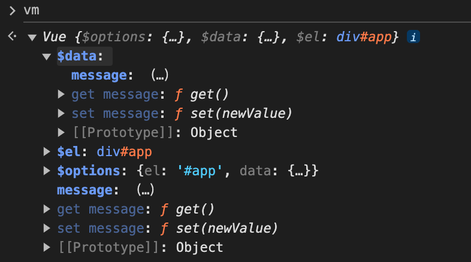

# mini-vue
模拟实现 Vue2.x 的响应式原理，实现了基本类型的双向绑定，支持v-text、v-model、差值表达式语法。
```vue
<template>
  <div id="app">
    {{ message }}
    <h1>{{message}}</h1>
    <h1 v-text="message"></h1>
    <input v-model="message">
  </div>
</template>

<script>
  const vm = new Vue({
    el: '#app',
    data: {
      message: 'Hello Vue',
    }
  })
</script>
```
## Vue2.x 响应式原理核心模块

### Vue 
- 负责接受初始化的参数（options）
- 负责把 data 中的属性注入到 Vue 实例，转换为 getter/setter
- 负责调用 observer 监听 data 中所有属性的变化
- 负责调用 compiler 解析指令/差值表达式

### Observer
- 负责把 data 选项中的属性转换成响应式数据。data 中的某个属性也是对象，把该属性转换成响应式数据。
- 数据变化发送通知；

### Compiler 
- 负责编译模板，解析指令、差值表达式
- 负责页面的首次渲染
- 当数据变化后重新渲染页面

### Dep 
- 负责收集 watcher，当数据发生变化时，通知 watcher 更新。

### Watcher 
- 当数据变化触发依赖，dep 通知所有 watcher 实例更新视图
- 自身实力化时往dep对象中添加自己

## 初始化 vue 实例
声明 Vue 类，用于初始化 vm 实例。初始化时接收一个 `options` 对象，包含 `el`、`data` 属性。
```js
class Vue {
  constructor(options) {
    // 负责接受初始化的参数（options）
    this.$options = options || {}
    this.$data = options.data || {}
    this.$el =
      typeof options.el === 'string'
        ? document.querySelector(options.el)
        : options.el
  }
}
```

在初始化时还需要把 data 中的属性注入到 Vue 实例，转换为 getter/setter。目的是可以通过 `vm.xxx` 访问 data 中的属性，通过 `vm.xxx = xxx` 修改 data 中的属性。

```js
class Vue {
  constructor(options) {
    // 负责接受初始化的参数（options）
    this.$options = options || {}
    this.$data = options.data || {}

    this.$el =
      typeof options.el === 'string'
        ? document.querySelector(options.el)
        : options.el
    // 负责把 data 中的属性注入到 Vue 实例，转换为 getter/setter
    this._proxyData(this.$data)
  }

  // 遍历 data 中的所有属性，把 data 中的属性注入到 vue 实例中
  _proxyData(data) {
    Object.keys(data).forEach((key) => {
      Object.defineProperty(this, key, {
        enumerable: true, // 可枚举
        configurable: true, // 可配置
        get() {
          return data[key]
        },
        set(newValue) {
          if (data[key] === newValue) return
          data[key] = newValue
          return true
        },
      })
    })
  }
}
```
在控制台打印 vm 实例，可以看到 data 中的属性被注入到 vm 实例中，并且转换为 getter/setter。


## 响应式数据
Observer 类负责把 data 中的属性转换成响应式数据。创建 Observer 类，接收一个 `data` 对象，遍历 `data` 对象的属性，调用 `defineReactive` 方法，把属性转换成响应式数据。
```javascript
class Observer {
  constructor(data) {
    this.walk(data)
  }

  walk(data) {
    if (!data || typeof data !== 'object') return
    Object.keys(data).forEach((key) => {
      this.defineReactive(data, key, data[key])
    })
  }

  defineReactive(obj, key, val) {
    const _that = this
    this.walk(val) // 如果 val 是对象，调用 walk 方法转为响应式对象
    Object.defineProperty(obj, key, {
      enumerable: true,
      configurable: true,
      get() {
        return val
      },
      set(newValue) {
        if (newValue === val) return
        val = newValue
      },
    })
  }
}
```
在 Vue 类中调用 Observer 类。

```js
class Vue {
  constructor(options) {
    ...
    this._proxyData(this.$data)
    new Observer(this.$data)
  }
  ...
}
```
在浏览器中打印 vm 实例，可以看到 data 中的属性被转换成响应式数据。



到这里为止 debug 看一下访问 vm.message 和修改 vm.message 的值时代码的执行顺序。
- 当访问 vm.message 是会触发 vm.message 的 getter 方法。而 getter 方法中会访问 data.message，从而触发了 data.message 的 getter 方法。
- 当修改 vm.message 的值时，会触发 vm.message 的 setter 方法。而 setter 方法中会访问 data.message，从而触发了 data.message 的 setter 方法。

这一步对于后续**收集依赖**和**发送通知**很重要，因为每次访问或修改 vm 上某个属性时 data.xxx 的 getter 方法会触发收集依赖，data.xxx 的 setter 方法会触发发送通知。

## 编译模板
vue 中有很多指令，如 v-text、v-model、v-if、v-for 等。对于 html 标签来说，这些指令是标签上的属性，在编译模板阶段要根据指令做相应的处理。对于 `{{}}` 差值表达式，要匹配中间内容并替换。这两件事都是在 `Compiler` 类中实现的。

首先根据类图创建 `Compiler` 类，接收 vm 实例，调用 `compile` 方法编译 `vm.$el`。
```js
class Compiler {
  constructor(vm) {
    this.el = vm.$el
    this.vm = vm
    this.compile(this.el)
  }

  // 编译模板，处理文本节点和元素节点
  compile(el) {}

  // 编译元素节点，处理指令
  compileElement(node) {}

  // 编译文本节点，处理差值表达式
  compileText(node) {}

  // 判断元素属性是否为指令
  isDirective(attrName) {}

  // 判断节点是否为文本节点
  isTextNode(node) {}

  // 判断节点是否为元素节点
  isElementNode(node) {}
}
```

在 compile 方法中，遍历 node 节点，调用 `isTextNode` 和 `isElementNode` 方法判断是文本节点还是元素节点，接着调用 `compileElement` 和 `compileText` 方法处理。
```js
complie(el) {
  let childNodes = el.childNodes
  Array.from(childNodes).forEach((node) => {
    if (this.isTextNode(node)) {
      // 处理文本节点
      this.compileText(node)
    } else if (this.isElementNode(node)) {
      // 处理元素节点
      this.compileElement(node)
    }

    // 判断node是否有子节点
    if (node.childNodes && node.childNodes.length > 0) {
      this.compile(node)
    }
  })
}
```

通过 node.nodeType 属性判断节点类型。
```js
// 判断节点是否为文本节点
isTextNode(node) {
  return node.nodeType === 3
}

// 判断节点是否为元素节点
isElementNode(node) {
  return node.nodeType === 1
}
```

先处理差值表达式，通过正则匹配中间内容并替换。
```js
// 编译文本节点，处理差值表达式
compileText(node) {
  // {{ message }}
  let reg = /\{\{(.+?)\}\}/
  let value = node.textContent

  if (reg.test(value)) {
    let key = RegExp.$1.trim()
    node.textContent = value.replace(reg, this.vm[key])
  }
}
```

这一步结束之后，页面上 `{{ message }}` 就会替换成 data.message 的值。接着处理元素节点，处理前先完善 `isDirective` 方法，用于判断属性名称是否以 v-xxx 开头。
```js
// 判断元素属性是否为指令
isDirective(attrName) {
  return attrName.startsWith('v-')
}
```

在 `compileElement` 方法中，遍历节点属性，判断是否绑定了 v-xxx 指令，如果是，则调用 `update` 方法更新视图。
```js
// 编译元素节点，处理指令
compileElement(node) {
  let attrs = node.attributes
  Array.from(attrs).forEach((attr) => {
    let attrName = attr.name
    if (this.isDirective(attrName)) {
      // v-text ---> text
      attrName = attrName.substring(2)
      let key = attr.value
      this.update(node, key, attrName)
    }
  })
}

update(node, key, attrName) {
  let updateFn = this[attrName + 'Updater']
  updateFn && updateFn(node, this.vm[key])
}

// 处理 v-text 指令
textUpdater(node, value) {
  node.textContent = value
}

// 处理 v-model 指令
modelUpdater(node, value) {
  node.value = value
}
```
最后，在 `Vue` 类中调用 `Compiler` 类，运行代码可以看到页面上的 `{{ message }}` 和 `<input>` 的值被替换成了 data.message 的值。

到这里 Compiler 类的前两件事已经写完了，第三件事要等 Dep 类 和 Watcher 类实现后在做。现在已经可以吧 data 中的变量显示在页面上了，那接下来要做的是 data 中的变量发生变化时，页面上的变量也要跟着变化。

## 收集依赖 和 发送通知
<!-- TODO: -->
Dep 类用于收集依赖，Watcher 类用于发送通知。

首先根据类图创建 Dep 类，接收一个数组，用于收集依赖。
```js
class Dep {
  constructor() {
    this.subs = [] // 存储观察者
  }

  // 添加观察者
  addSub(sub) {
    if (sub && sub.update) {
      this.subs.push(sub)
    }
  }

  // 发送通知
  notify() {
    console.log(this.subs)
    this.subs.forEach((sub) => {
      sub.update()
    })
  }
}
```

接着要创建 Watcher 类，接收一个回调函数，用于发送通知。
```js
// - 当数据变化触发依赖，dep通知所有watcher实例更新视图
// - 自身实力化时往dep对象中添加自己
class Watcher {
  /**
   *
   * @param {vue} vm vue实例
   * @param {string} key  属性
   * @param {function} cb 回调函数负责更新视图
   */
  constructor(vm, key, cb) {
    this.vm = vm
    this.key = key
    this.cb = cb
    // 把 watcher 实例记录到Dep类的静态属性target上
    Dep.target = this
    // 触发 get 方法，在 get 方法中调用 addSub
    this.oldValue = vm[key]
    Dep.target = null
  }
  // 当数据发生变化时更新视图
  update() {
    let newValue = this.vm[this.key]
    if (newValue === this.oldValue) return
    this.cb(newValue)
  }
}
```
